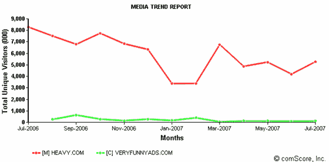

# Didja.com 一瞥:VeryFunnyAds 克隆 TechCrunch

> 原文：<https://web.archive.org/web/http://www.techcrunch.com:80/2007/08/17/a-peek-at-didjacom-veryfunyads-clone/>

# Didja.com 一瞥:非常有趣的克隆

虽然“广告娱乐”网站 Didja.com 明年才会推出，但 NYT 已经先睹为快了。NBC 环球项目是尚未命名的新闻集团/NBC 环球针对 Youtube 的合作战略的一部分。然而，新公司在 YouTube 上的第二部《T4》看起来更像是 TBS 的《非常有趣》的克隆版。这与 TBS 重塑品牌的努力非常相似，让用户通过搜索、评级以及不同公司和国家的分类来观看大量广告。

如果新公司复制了一个成功的网站，这一切都说得通，但 VeryFunnyAds 似乎不是一个彻底的赢家，尽管网站文章称他们在过去一年中提供了 6300 万次点击。这个浏览量表明，平均每个月有 500 万个视频流，但该网站的观众人数并没有增加。

根据[康姆斯克](https://web.archive.org/web/20230126130254/http://comscore.com/)的说法，在推出初期的高峰之后，VeryFunnyAds 的流量已经逐渐减少到每月 10 万个。6300 万的视频流对于这种规模的观众来说是一个很大的流量，尤其是因为他们不允许异地视频嵌入。Heavy.com 的网络在 4 月份产生了约 600 万条数据流，每月有约 520 万条唯一数据流。如果这些数字是真的，那么 TBS 的网站似乎最多只能吸引一小部分广告狂热者。

与流传的“广告”模因相反，它看起来没有腿。

