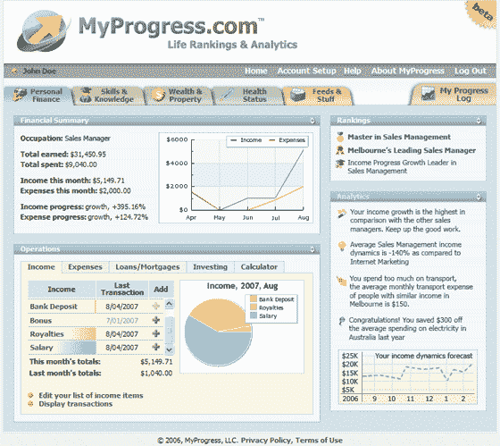

# 我的进度让你追踪你的进度

> 原文：<https://web.archive.org/web/http://www.techcrunch.com/2007/08/18/myprogress-lets-you-track-your-progress/trackback/>

### 邓肯·赖利

 总部位于温哥华的 [MyProgress](https://web.archive.org/web/20080724003910/http://myprogress.com/) 提供一项服务，该服务为生活跟踪提供进度监控功能(通常用于计算机角色扮演游戏中)。

MyProgress 允许用户跟踪他们的个人财务、技能、“知识”、财富和健康动态。

该网站跟踪用户输入的每一条信息，从新购买的物品、资本收益、一小时的摄影或驾驶体验，或者租赁价格的变化，并提供详细的概览，说明他们在多个类别(如年龄、职业和位置)上与其他人相比的进展速度。该服务提供关于用户生活的分析，并根据过去的数据建立预测。

MyProgress 被宣传为世界上第一个在线应用程序，“旨在帮助个人(而不是公司)管理他们的进度，并以 RSS 提要的形式阅读他们的生活日志。”

这篇文章发表于 2007 年 8 月 18 日星期六晚上 11:34，归档在[公司&产品简介](https://web.archive.org/web/20080724003910/http://www.techcrunch.com/category/company-product-profiles/ "View all posts in Company & Product Profiles")下。您可以通过 [RSS 2.0](https://web.archive.org/web/20080724003910/http://www.techcrunch.com/2007/08/18/myprogress-lets-you-track-your-progress/feed/) feed 关注该条目的任何回复。评论和 pings 目前都已关闭。