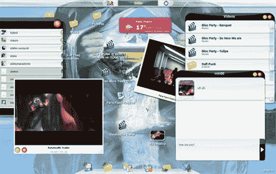

# 法国 Jooce 进入 WebOS 空间

> 原文：<https://web.archive.org/web/http://www.techcrunch.com/2007/08/20/frances-jooce-enters-webos-space/trackback/>

### 迈克尔·阿灵顿

新的巴黎创业公司称他们的新的基于 Flash 的网络操作系统和分享平台瞄准了“网吧一代”。

Jooce 最像 [Goowy](https://web.archive.org/web/20080724151517/http://www.crunchbase.com/company/Goowy) ，另一个基于 Flash 的网络操作系统/桌面。但是 Jooce 与众不同，值得仔细观察。他们说，每天有 5 亿人从网吧登录互联网，他们是 Jooce 产品的目标。他们希望访问核心定制应用，如即时消息、存储、媒体播放器、电子邮件和小工具。Jooce 提供了所有这些，也是一个朋友间的私人分享网络。

每个用户都有自己的私人桌面，用于即时消息、电子邮件、存储等。但他们也有另一个桌面，朋友们可以访问和获取共享文件，或放下他们想要共享的文件。

该公司已经从 Skype 的原始投资者之一 Mangrove Capital Partners 获得了第一轮种子融资。它目前是一个封闭的平台，但他们将在不久的将来发布一个 API。

Jooce 进入了一个拥挤的空间，但目标是明确的观众。背靠红树林也不疼。

总部位于以色列的另一家网络操作系统初创公司最近推出了一种不同于 Jooce 的方法。他们已经构建了一些基本的应用程序来展示这个平台，但是还指望第三方通过他们的 API 来完成大部分繁重的工作。

此条目发布于 2007 年 8 月 20 日星期一 11:21，归档于[公司&产品简介](https://web.archive.org/web/20080724151517/http://www.techcrunch.com/category/company-product-profiles/ "View all posts in Company & Product Profiles")下。您可以通过 [RSS 2.0](https://web.archive.org/web/20080724151517/http://www.techcrunch.com/2007/08/20/frances-jooce-enters-webos-space/feed/) feed 关注该条目的任何回复。评论和 pings 目前都已关闭。