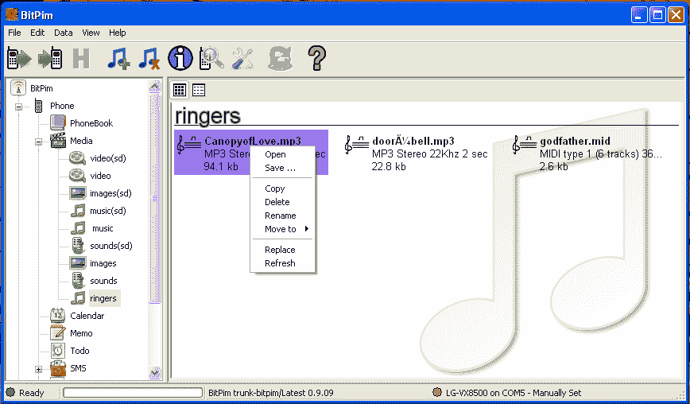

# 帮助提示:如何使用一根 6 美元的 USB 线和免费软件让你的非智能手机变得更智能

> 原文：<https://web.archive.org/web/http://techcrunch.com/2007/08/20/help-key-how-to-use-a-6-usb-cable-and-free-software-to-smarten-up-your-non-smartphone/>

我们不确定为什么越来越多的手机不配备 USB 连接线，但事实是大多数手机都不配备。我们讨厌这样的想法:你的手机上有所有这些数据，除了昂贵的无线信息，你没有办法添加更多或备份这些数据。一些提供商允许你免费将你的电话簿备份到他们的网站上，但是如果你取消了你的帐户，它就永远消失了。但你喜欢自己做事情，这就是我们在这里的原因。

不是每部手机都可以用这种手动方式备份，这确实很糟糕。也就是说，本指南适用于大多数没有自带软件的 CDMA 或 GSM 手机。像 Treos 或摩托罗拉 Qs 这样的智能手机通常都自带电缆和软件，这显得有些多余。然而，大多数 29 美元的合约手机将会从这个指南中受益。

无论是在 Windows 电脑上还是在 Mac 电脑上，设置和同步你的手机实际上比大多数人意识到的要容易得多。甚至 Linux 也能参与进来。你所需要的只是一根合适的 USB 线。你可以在一些百思买或电台小屋买到它们，但毫无疑问，[最划算的交易是在易贝](https://web.archive.org/web/20221001061247/http://search.ebay.com/search/search.dll?from=R40&_trksid=m37&satitle=lg+usb+cable&category0=)。零售价为 20 到 40 美元一个，但在易贝，你可以找到大约 6 美元一个的。有时甚至更少。

电缆有时会附带一些蹩脚的驱动程序或第三方地址簿管理器。你不再需要它们了。大多数手机都有制造商网站上提供的驱动程序，它们几乎总是比光盘上的驱动程序更新，所以把它做成杯垫。

一旦安装了驱动程序，当手机通过电缆插入时，您的电脑就可以识别手机。这是第一步。既然硬件可以配合得很好，那么是时候让软件来完成工作了，这个软件就是 [BitPim](https://web.archive.org/web/20221001061247/http://www.bitpim.org/) 。

BitPim 是一款开源的手机管理应用，可用于 Windows、Mac 或 Linux 操作系统，在这三种操作系统上的运行效果大致相同。它被设计成一个简单而强大的万能工具，并且令人钦佩地达到了这个目标。

电话簿模块非常棒，你可以用它来克隆你的电话簿，进行修改，添加或删除条目，在一些手机上甚至可以创建群组。最棒的是，备份不是以某种晦涩的格式进行，而是以 CSV 格式进行，这意味着可以很容易地从一部手机备份到另一部手机，从而轻松地将您的号码转移到新手机。我们喜欢简单。

当你第一次启动 BitPim 时，它会扫描你的 USB 端口寻找手机。如果你的驱动程序安装正确，它会自动检测你的手机型号，然后自动配置自己处理数据。一旦你在那里，点击手机导入按钮。这会将所有电话数据备份到本地副本。这是您将要编辑的内容，因此如果您搞砸了，您的手机信息仍然是安全的。

当你得到了你想要的改变，你点击电话出口按钮。这会将更改写入电话簿。速度挺快的，几乎所有手机都支持这个功能。

这并不是 BitPim 和你的 USB 线能对你的手机做的唯一的事情。如果你愿意的话，你可以登录并备份你的短信。或者您可以在日历上手动添加或删除事件。一些手机甚至可以让你与 iCal、Entourage 或 Outlook 同步，这对于那些想随时了解最新日程安排，但又不想为大多数提供商欺骗我们的数据计划付费的人来说，真是太方便了。

如果你的手机有 notes 应用程序，你甚至可以在大多数手机上同步你的 Outlook 任务和笔记。这是一个手动同步，意味着你必须拖放，但这比在 T9 上手动输入驾驶方向要好。

一个整洁的区域是媒体目录，你可以手动抓取你拍摄的照片和视频并保存到你的电脑上，或者通过电子邮件发送出去，甚至上传到 YouTube 或 Flickr。更重要的是，你可以添加媒体。你有一个最喜欢的桌面放在你的手机上吗？只需将它拖入并导出，就大功告成了。你会想检查和看看你的手机支持什么格式，因为一些手机上的图像库仅限于某些 JPEG 格式。

除了图片，你还可以用 BitPim 的这部分来添加铃声。找出你的手机支持什么类型，你就可以了。你可以从互联网上的很多网站下载它们，只要搜索 MIDI 铃声，你就会找到很多免费网站。如果你的手机支持 MP3 铃声，你可以直接复制过来，你的铃声就设置好了。当心一些电话有 1MB 的铃声限制。如果你的语气不起作用，试着降低它。

如果你的手机是音乐手机，就像现在大多数手机一样，你可以使用播放列表功能来组织你的音乐，就像 iTunes 一样。很遗憾，BitPim 不允许你的手机与 iTunes 同步，但总比没有好。这是另一种手动拖放操作，但它使音乐手机实际上可用。

如果你的手机支持游戏，你可以下载一些免费的基于 Java 的娱乐软件并加载。既然可以自己免费加载，为什么还要为 Doom 支付 4.99 美元？

有相当多的程序和你的电缆可以做你的手机，但大部分不是很好。除非你很勇敢或者知道自己在做什么，否则你应该远离文件系统菜单。即使改变文件或文件夹名称中的一个字母也会损坏你的手机，这可不好。下面的所有内容都是在我们刚刚讨论过的顶部菜单中完成的，所以没有真正的理由去使用它。

像任何类型的数据操作一样，聪明地工作是值得的。当你的手机被识别后，你要做的第一件事就是备份所有的东西，这是程序允许你做的。这样，即使你完全搞砸了，你也可以让它回到原来的样子。

玩转使用这一切，使您的手机真正成为您的手机。我们提到过 BitPim 是免费的并且功能齐全吗？不仅如此，开发商不要捐款。不过，你可以帮忙，让他们借你的旧手机来测试。他们承诺会好好对待它，这是一种即使非技术人员也能为开源世界做出贡献的方式。帮助后的一周，你会感到温暖和有趣。