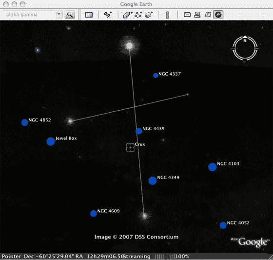
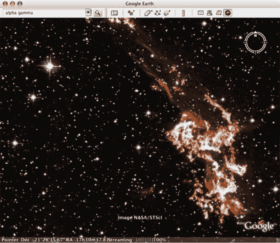

# 谷歌地球向星星进发

> 原文：<https://web.archive.org/web/http://www.techcrunch.com/2007/08/22/google-earth-heads-for-the-stars/trackback/>

### 邓肯·赖利

 谷歌为谷歌地球推出了天空，这是一项新功能，将星星的图像添加到谷歌地球已经广泛的地球图像中。

据[谷歌、](https://web.archive.org/web/20080725000216/http://google-latlong.blogspot.com/2007/08/sky-final-frontier.html)称，新功能允许用户“坐在舒适的椅子上探索宇宙”用户可以放大几亿光年之外的星系，探索星座，甚至见证超新星爆炸。

太空图像包括来自各种来源的 100 多万张照片，包括斯隆数字巡天、加州理工学院的帕洛马天文台和哈勃望远镜。

人们常说，谷歌地球和谷歌地图将制图带到了大众面前，Sky 也可以为天文学做同样的事情。

要访问 Sky，用户必须下载最新版本的谷歌地球。

 

这篇文章发表于 2007 年 8 月 22 日星期三下午 2:14，归档在[公司&产品简介](https://web.archive.org/web/20080725000216/http://www.techcrunch.com/category/company-product-profiles/ "View all posts in Company & Product Profiles")下。您可以通过 [RSS 2.0](https://web.archive.org/web/20080725000216/http://www.techcrunch.com/2007/08/22/google-earth-heads-for-the-stars/feed/) feed 关注该条目的任何回复。评论和 pings 目前都已关闭。