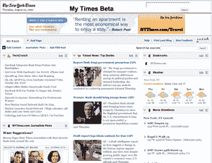

# 纽约时报推出…我的雅虎

> 原文：<https://web.archive.org/web/http://www.techcrunch.com/2007/08/23/nytimes-launches-myyahoo/trackback/>

 《纽约时报》今天取消了他们的个性化主页产品的测试版——点击这里。外观和感觉与一年前差不多，当时它[进入了私人测试版](https://web.archive.org/web/20100902181050/http://www.techcrunch.com/2006/07/11/nytimes-launches-mytimes/)——想想 [MyYahoo](https://web.archive.org/web/20100902181050/http://www.techcrunch.com/2007/03/08/all-new-my-yahoo/) 、 [Pageflakes](https://web.archive.org/web/20100902181050/http://www.crunchbase.com/company/pageflakes) 或 [Netvibes](https://web.archive.org/web/20100902181050/http://www.crunchbase.com/company/netvibes) ，带有纽约时报的标志，但没有小工具。

有一种观点认为，该产品将为大众带来定制的主页，尽管坦率地说，雅虎已经在这方面做得很好，拥有超过 5000 万用户。这对生活、饮食和呼吸《纽约时报》的人来说尤其有用，但其他人可能会觉得有点过了。

用户还可以添加预先选择的非 NYT 内容或自己喜欢的 RSS 提要，模块可以在页面上拖动，就像其他可定制的主页一样。