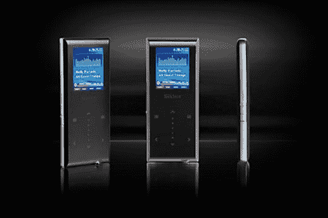

# 哦，不太好:TrekStor 称 MP3 播放器为“i.Beat blaxx”

> 原文：<https://web.archive.org/web/http://techcrunch.com:80/2007/08/26/ooh-not-good-trekstor-calls-mp3-player-ibeat-blaxx/>

# 哦，不太好:TrekStor 称 MP3 播放器为“i.Beat blaxx”

呀。不太好。一点都不好。德国的 TrekStor 公司在它的“i.Beat”系列中推出了一款名为“blaxx”的新 MP3 播放器。

把这些放在一起，你就有了一个小小的营销/公关噩梦。

[TrekStor 新闻稿](https://web.archive.org/web/20230119162458/http://www.trekstor.de/en/news/index_detail.php?id=119)通过 [Gizmodo](https://web.archive.org/web/20230119162458/http://gizmodo.com/gadgets/seriously%3F/a-letter-to-trekstor-re-racist-ibeat-blaxx-mp3-player-293515.php)