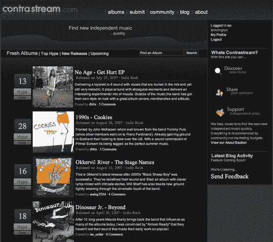
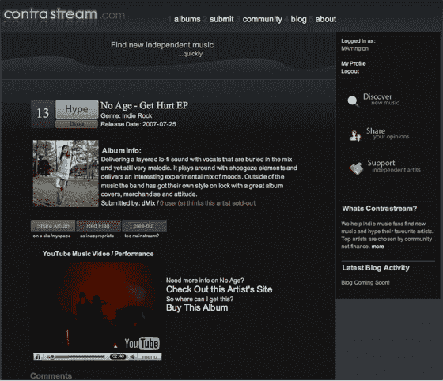

# 加入社交音乐网站

> 原文：<https://web.archive.org/web/http://www.techcrunch.com/2007/08/27/contrastream-to-join-social-music-sites/trackback/>

  如果你正在进入[社交音乐领域](https://web.archive.org/web/20150807004317/http://www.techcrunch.com/2007/02/05/social-music-overview/)，书签 [ContraStream](https://web.archive.org/web/20150807004317/http://contrastream.com/) ，一个新的音乐发现引擎，并在 9 月 3 日发布时回到它。

该网站承诺帮助用户快速找到好音乐。艺术家上传独立音乐，其他人在 Digg-fashion 上投票，把好的东西推到网站的顶部。它至少有点类似于 ijgg，后者也让用户像 Digg 一样对音乐进行投票。

ContraStream 将利用用户生成的投票数据来创建让用户搜索/浏览流行音乐。每个艺术家和专辑在网站上都有自己的专属页面。

为了“保持音乐的独立性”，用户被鼓励标记“太主流”的音乐

在 [Scopetech](https://web.archive.org/web/20150807004317/http://www.scopetech.net/2007/08/27/find-music-with-contrastream/) 查看更多信息。

