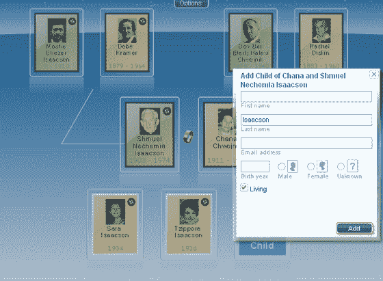

# MyHeritage 利用 1.8 亿人的个人资料与 Geni | TechCrunch 开战

> 原文：<https://web.archive.org/web/http://www.techcrunch.com:80/2007/08/28/myheritage-takes-180-million-people-profiles-to-war-with-geni/>

以色列初创公司 [MyHeritage](https://web.archive.org/web/20230405212401/http://www.crunchbase.com/company/MyHeritage) 有点像一个沉睡的巨人。直到新来者 Geni 出现，并以其巧妙的新病毒式家谱应用震动了家谱世界。Geni 在推出几个月后就迅速达到了 500 万人的个人档案和 1 亿美元的估值。

我的遗产从 2005 年就有了。他们已经悄悄地筹集了 900 万美元的风险投资(大约一半来自 Accel，另一半来自两位天使投资人 Yuval Rakavy 和 Aviv Raiz)。直到最近，MyHeritage 还要求用户从基于桌面的软件上传家族谱系信息。这些信息可以在网上查看，但无法更改。一个笨拙的系统，但他们仍然设法从 1720 万用户那里收集了 150，000 个家谱和 1.8 亿个人资料。每天新增 150，000 个个人资料。这让 Geni 相形见绌，虽然我的遗产已经领先很久了。

几周前，MyHeritage 公布了他们服务的一些基本架构变化。他们吸取了 Geni 的最佳特性，并把它们与过去几年一直有效的我的遗产结合起来。

用户现在可以上传数据(姓名、电子邮件、出生/死亡日期、照片等)。)直接登录 MyHeritage 网站，从 17 种不同的语言中进行选择。用户界面就像 Flash 中的 Geni 一样，显示了几个不同的视图，可以快速地在家谱中移动。已经有超过 1 亿张照片被上传到网站上，用户可以给脸贴上姓名标签，并将其附加到用户资料中。

然而，这并不是我的全部遗产。去年年底，他们收购了珍珠街软件公司。那次收购为该公司带来了匹配技术，允许该服务比较家谱以找到重叠部分——即使名字拼写不同或基本数据有些出入(例如，出生或死亡日期略有不同)。他们刚刚开始推出匹配服务，但他们希望看到家谱之间有很多重叠。如果双方同意，树木可以在适当的地方合并。

MyHeritage 希望有一天能像 Geni 一样，将世界上的许多家谱绘制到网上。鉴于目前有 10 亿人上网，MyHeritage 的 1.8 亿人档案是实现这一目标的良好开端。他们最终希望拥有 30 亿个人资料，包括已经去世的人。到那时，世界上任何两个人之间的家庭关系只需点击一下鼠标。

这是一个宏伟的愿景，但有一天可能会由 MyHeritage 或他们的竞争对手实现。

另外，MyHeritage 还有一个强大的(免费的)家谱[元搜索引擎](https://web.archive.org/web/20230405212401/http://www.myheritage.com/FP/Company/myheritage-research.php)，可以接入全球 1200 个家谱数据库。