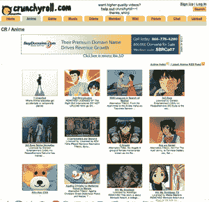

# Crunchyroll 挑战视频版权的极限

> 原文：<https://web.archive.org/web/http://www.techcrunch.com/2007/08/29/crunchyroll-pushes-the-envelope-on-video-copyright/trackback/>

 [Crunchyroll](https://web.archive.org/web/20131220053628/http://www.crunchbase.com/company/crunchyroll) 是一家总部位于三藩市的初创公司，是一种类似于 YouTube 的网站，提供动漫和其他主要是亚洲视频内容。三位要求匿名的创始人都是 HotOrNot 的员工，公司在 HotOrNot 的旧金山办公室运作(尽管据创始人称，HotOrNot 在公司没有任何经济利益)。

该网站于 2006 年夏季推出，发展迅速，尤其是自 2007 年 3 月以来。comscore 的全球统计数据显示，7 月份有 130 万独立访客，高于 3 月份的 48 万。该公司 7 月份的页面浏览量也接近 1 亿，每月页面浏览量增长 20%。

这种增长显然足以引起至少一个潜在买家的注意，那就是维亚康姆。一位消息人士告诉我们，今年早些时候，该公司非常接近以 1000 万美元的价格出售给维亚康姆，但当维亚康姆意识到拥有包含大量侵犯版权内容的网站可能会损害他们在与谷歌进行的数十亿美元诉讼中的地位时，这笔交易失败了。Crunchyroll 拒绝对这笔交易发表评论。

所有视频都是用户上传的，周围都有广告。每月向该网站“捐赠”6 美元的高级用户可以获得无广告版本和更高质量的视频。有传言称，该公司每月收入约为 7.5 万美元。

 Crunchyroll 的商业模式很独特，因为用户付费给他们观看高质量版本的内容，其中大部分内容侵犯了版权。这无疑削弱了他们对数字千年版权安全港条款的依赖，该条款保护服务提供商免于为用户上传的内容承担责任。

安全港条款仅在服务提供商“未获得可直接归因于侵权活动的经济利益”的情况下适用。围绕受版权保护的内容做广告是否是一种直接的经济利益，这是有争议的，但更难提出直接的订阅费，即使它被归类为“捐赠”也不会违反这一条款。无论哪种方式，克朗彻罗尔无疑是在 DMCA 法案下将可接受的行为推向了极限。

**突破极限往往有利可图**

有趣的是，在著作权法方面，一些最糟糕的违法者最终都做得很好。

[ALLOfMP3](https://web.archive.org/web/20131220053628/http://www.crunchbase.com/company/allofmp3) 继续[运营](https://web.archive.org/web/20131220053628/http://www.techcrunch.com/2007/08/26/allofmp3-to-rise-from-the-dead/)尽管被 RIAA 以 1.65 万亿美元起诉。侵权之王 YouTube 以 16.5 亿美元的高价卖给了谷歌。 [Blogmusik 成功达成许可交易](https://web.archive.org/web/20131220053628/http://www.techcrunch.com/2007/08/21/blogmusik-comes-back-with-a-legal-free-music-on-demand-service/)并继续经营。[伊梅姆](https://web.archive.org/web/20131220053628/http://www.crunchbase.com/company/imeem)尽管过去充满波折，但现在却像野草一样茁壮成长。名单还在继续。

克朗彻罗尔对优质捐赠的追求是如此大胆，以至于它可能对他们有用。该公司表示，他们会定期遵守 DMCA 的删除通知和其他要求，删除内容。他们说，总的来说，他们与动漫和其他内容创作者的关系非常好。其中一些内容创作者甚至接触了该公司，并建议合作。

最终，Crunchroll 拥有超过 100 万热情的动漫用户，他们每天都会来网站查看内容。商业模式是次要的。聪明的内容所有者会找到挖掘用户群并赚更多钱的方法。

到目前为止，克朗彻罗尔还没有筹集到任何资金，但现在正在与风险投资家交谈。