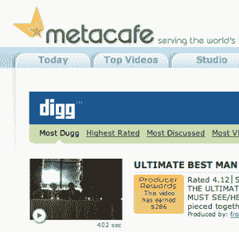

# 如果你赢不了他们，那就加入 Digg

> 原文：<https://web.archive.org/web/http://www.techcrunch.com/2007/08/29/if-you-cant-beat-em-join-digg/trackback/>

 视频分享网站 [MetaCafe](https://web.archive.org/web/20110307030704/http://www.crunchbase.com/company/metacafe) 今天在他们的网站上推出了一个新的[区域](https://web.archive.org/web/20110307030704/http://www.metacafe.com/digg/)，使用 [Digg API](https://web.archive.org/web/20110307030704/http://www.techcrunch.com/2007/04/20/digg-releases-public-api-san-francisco-tech-crowd-parties-hard/) 展示最受欢迎的 MetaCafe 视频。

查看者可以按最多 dugg、最高评级、最多讨论、最多观看等进行排序。仅显示 Metacafe 视频。

Digg 的视频频道和 Metacafe 有些重叠，特别是对于那些只想快速找到并浏览有趣视频的人。这让他们配对变得有点不太可能——我本以为 Metacafe 会简单地构建自己类似 Digg 的投票系统，或者使用 Pligg 的开源软件(参见最近见诸报端的 VideoSift 的类似功能)。他们与 Digg 合作的事实表明，他们愿意把自己的品牌绑在这颗流星上，该死的竞争角度。

Metacafe 今天下午发布了关于新功能的新闻稿。值得注意的是，这次发布中没有提到 Digg，他既没有联合发布，也没有提供报价。(更新–见下文[注释#2](https://web.archive.org/web/20110307030704/http://www.techcrunch.com/2007/08/29/if-you-cant-beat-em-join-digg/#comment-1577135) )。