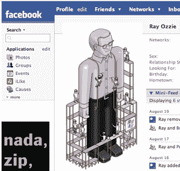

# 为什么微软高管对脸书如此积极？另外:比尔·g 到底辣不辣？

> 原文：<https://web.archive.org/web/http://www.techcrunch.com:80/2007/08/30/microsoft-execs-active-on-facebook-plus-is-bill-g-hot-or-not/comment-page-2/>

微软员工甚至高管在[脸书](https://web.archive.org/web/20100903062401/http://www.crunchbase.com/company/facebook)上非常活跃——超过 [13，000](https://web.archive.org/web/20100903062401/http://www.facebook.com/networks/?nk=50431654) 的员工在该服务上拥有个人资料。

相比之下，谷歌有 5000 名员工有个人资料，尽管拉里·佩奇、谢尔盖·布林和埃里克·施密特明显缺席(玛丽莎·梅耶尔确实有个人资料，并积极添加好友)。雅虎只有 3，500 名员工的个人资料，没有一个最高级的高管参与其中。

按员工比例计算，谷歌(47%的员工在脸书)和雅虎(31%)比微软(17%)更活跃。但是微软最资深的人，包括比尔·盖茨(董事长)、史蒂夫·鲍尔默(首席执行官)、雷·奥茨(首席软件架构师)，都有个人资料，而且似乎在这项服务上非常活跃。雷·奥茨有几十个朋友，正在积极尝试不同的脸书应用程序。例如，在过去的几天里，他添加然后删除了一个搜索应用。

比尔·盖茨可能会做得更好。除了拥有一个脸书的个人资料，他还在 HotOrNot 上维护了一个可以在脸书查看的[个人资料(HotOrNot 证实这是真实的比尔盖茨)。](https://web.archive.org/web/20100903062401/http://apps.facebook.com/hotornot/meet/index.php?id=502040841)

既然比尔、史蒂夫和雷不太可能有很多闲暇时间进行社交网络和网上约会，我想知道他们为什么把所有时间都花在网站上？

当然，这两家公司有长期的广告协议。但这笔交易的成功与否与微软高管在该网站上花费的时间关系不大。在我看来，他们是真的在测试这项服务，或许是希望进行一次积极的收购，或者试图效仿脸书的成功。