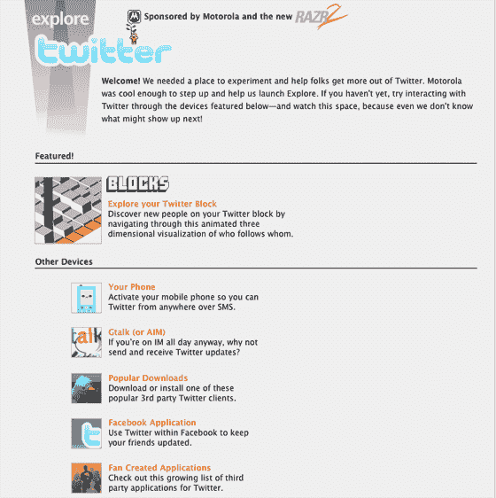

# 新的 Twitter 可视化工具即将推出:首先是 Twitter Blocks——TechCrunch

> 原文：<https://web.archive.org/web/http://www.techcrunch.com/2007/08/30/new-twitter-visualization-tools-twitter-blocks-on-friday-morning/trackback/>

# 新的 Twitter 可视化工具即将到来:首先是 Twitter Blocks

推特团队一定在办公室安装了红牛机器，因为他们突然到处发布新东西。

他们最近为这项服务增加了[搜索](https://web.archive.org/web/20200810084952/http://www.beta.techcrunch.com/2007/08/21/finally-twitter-adds-search/)和 [Gmail 导入](https://web.archive.org/web/20200810084952/http://www.beta.techcrunch.com/2007/08/26/twitter-adds-gmail-import-feature/)功能。周五，他们将在网站上推出一个名为“ [Explore](https://web.archive.org/web/20200810084952/http://explore.twitter.com/) 的新区域，在那里他们将列出一些人们可以用来在网站之外与 Twitter 互动的工具。除了 Explore，他们还将发布一个新的可视化工具，名为[Twitter](https://web.archive.org/web/20200810084952/https://crunchbase.com/organization/twitter)Blocks——“一种导航你的 Twitter 邻居或街区的抽象方式。

Twitter 向我们发送了这些截屏，但我们还没有机会看到它的实际应用。联合创始人比兹·斯通说:“这是一个疯狂的，互动的，动画 3D 应用程序，所以当你与它互动时更容易理解。”

Twitter 请来了 Stamen Design 来帮助这个项目，这个团队也是去年推出的 Digg 可视化工具的幕后团队。

摩托罗拉赞助了新的探索网站。下面的屏幕截图:

