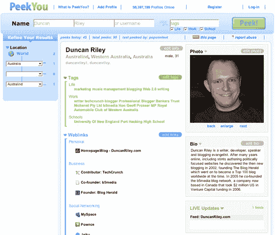

# PeekYou: Spock 有竞争对手——TechCrunch

> 原文：<https://web.archive.org/web/http://www.techcrunch.com:80/2007/08/30/peekyou-spock-has-competition/>

# 史巴克有竞争对手

 [PeekYou](https://web.archive.org/web/20220819050755/http://www.crunchbase.com/company/peekyou) 是一个相当新的网站，在日益拥挤的搜索空间中竞争。

该网站提供了我们期望从以人为本的搜索网站中得到的标准功能。一般的用户配置文件包括标签，标签分为三类(生活、工作和学校),用于上下文、网络链接(包括社交网络配置文件)、简历和图片。

PeekYou 由迈克尔·赫西创立，他创建了包括 RateMyTeachers.com 在内的网站，这些网站后来被 MTV 收购。Hussey 认为 PeekYou 是“网络和虚拟人物页面的最终重新索引，跨越整个网络，为个人分配唯一的身份，这些个人由社交网络页面、博客帖子、新闻报道和已知的在线别名组成。”好吧，这是一个难题，但他至少有远大的目标。该网站于 2007 年 7 月推出。

PeekYou 直接与 [Spock](https://web.archive.org/web/20220819050755/http://www.crunchbase.com/company/spock) 竞争，在某些方面也与 [Wink](https://web.archive.org/web/20220819050755/http://www.crunchbase.com/company/wink) 竞争(见我们的 Spock coverage [此处](https://web.archive.org/web/20220819050755/http://www.beta.techcrunch.com/tag/spock)，其他[此处](https://web.archive.org/web/20220819050755/http://www.beta.techcrunch.com/2007/05/09/war-of-the-people-search/))，因此需要进行直接比较。在某些方面，我比史巴克更喜欢偷看你。这可能是美学:PeekYou 看起来更好看，在编辑方面似乎也更好玩，因为 Spock 可能会提供更好的链接，因为它的用户数量更高，但它看起来不那么好。PeekYou 中的数据，至少对我检查的几个人来说，似乎也更容易访问(目前)。例如，比较《PeekYou》和《Spock》中的迈克尔·阿灵顿(此处为[此处为](https://web.archive.org/web/20220819050755/http://www.peekyou.com/USA/California/Menlo_Park/Michael_Arrington/4680)和[此处为](https://web.archive.org/web/20220819050755/http://www.spock.com/Michael-Arrington))，你会立即了解《PeekYou》中的迈克尔是什么样的人，因为《Spock》中可能有更多的标签和关系，但它们被部分掩盖，在上下文中并不总是立即清晰。总之，斯波克可能得到了所有的关注，但 PeekYou 确实提供了一个不错的选择。

