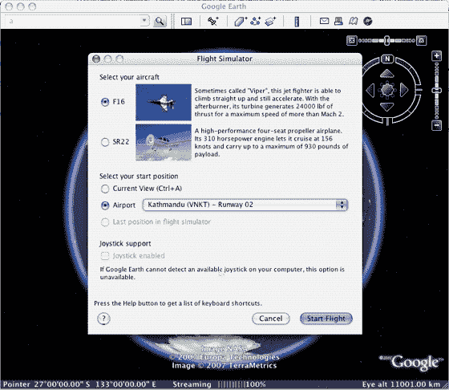
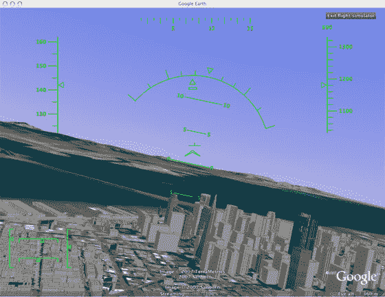

# 谷歌地球隐藏的惊喜:一个飞行模拟器

> 原文：<https://web.archive.org/web/http://www.techcrunch.com:80/2007/08/31/%20google-earths-easter-egg-a-flight-simulator/>

### 邓肯·赖利

 我们一直都知道谷歌想在许多领域挑战微软的桌面统治地位，但迄今为止我们还不知道这种挑战会延伸到游戏领域。

隐藏在谷歌地球内部的是一个秘密的飞行模拟器，它充分利用了谷歌广泛的卫星图像。

要访问隐藏的功能，打开谷歌地球，点击 Command+Option+A(注意必须是大写的 A)或 Ctrl+Alt+A(如果你使用的是 Windows 机器)。

谷歌地球飞行模拟器有两种飞机选择，一种是 F16 蝰蛇，另一种是更易管理的 SR22 四座飞机。玩家可以选择从他们在谷歌地球的当前位置开始游戏，也可以从预先确定的跑道列表中选择。控制指令可以在这里找到[。](https://web.archive.org/web/20080119015044/http://earth.google.com/intl/en/userguide/v4/flightsim/index.html)

总的来说，游戏操作在控制方面相当简单，但是显著的不同是飞越真实的地点图片。我从旧金山国际机场乘坐了一趟快速航班，向北前往金门，然后在前往山谷之前折回市区。它并不完美，但在视觉上与付费的微软飞行模拟器一样好，而且在实际呈现真实物体方面更好。

感谢 [Marco](https://web.archive.org/web/20080119015044/http://marco-za.blogspot.com/2007/08/google-earth-flight-simulator.html) 的指导。

该条目发布于 2007 年 8 月 31 日星期五下午 6:08，归档于[公司&产品简介](https://web.archive.org/web/20080119015044/http://www.techcrunch.com/category/company-product-profiles/ "View all posts in Company & Product Profiles")下。您可以通过 [RSS 2.0](https://web.archive.org/web/20080119015044/http://www.techcrunch.com/2007/08/31/google-earths-easter-egg-a-flight-simulator/feed/) feed 关注该条目的任何回复。评论和 pings 目前都已关闭。