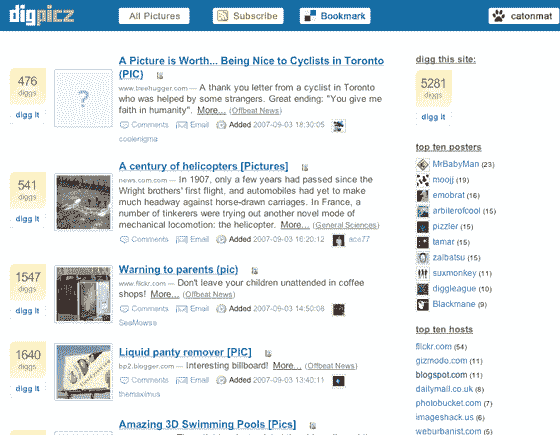

# Digpicz:非官方的 Digg 图片浏览器 TechCrunch

> 原文：<https://web.archive.org/web/https://techcrunch.com/2007/09/03/digpicz-the-unofficial-digg-picture-browser/>

# Digpicz:非官方的 Digg 图片浏览器

[【Digpicz】](https://web.archive.org/web/20221209131657/http://digpicz.com/)提供了 Digg 的一个众所周知但尚未提供的功能:图片浏览。

Digpicz 来自 Peteris Krumins，他是 Reddit 的非官方多媒体版 RedditMedia 的幕后人。

该网站是如何建立的细节可以在[这里](https://web.archive.org/web/20221209131657/http://www.catonmat.net/blog/designing-digg-picture-website/)找到。Digpicz 从 Digg API 中提取数据，因此它应该相当准确和全面，尽管作为一个非官方网站，它的标志和名称必然会引起商标问题，看看它是否被 Digg 自己单独留下会很有趣。

(via [狂乱的行业](https://web.archive.org/web/20221209131657/http://franticindustries.com/blog/2007/09/03/digg-gets-an-unofficial-picture-section-too/) )
