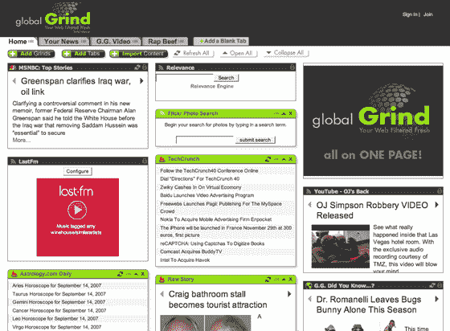

# 全球研磨:Ajax，最终面向嘻哈人群 TechCrunch

> 原文：<https://web.archive.org/web/https://techcrunch.com/2007/09/26/global-grind-ajax-finally-for-the-hip-hop-demographic/>

# 全球研磨:Ajax，最后，为嘻哈人口

 全球[嘻哈](https://web.archive.org/web/20230131163413/http://en.wikipedia.org/wiki/Hip_hop)社区:2400 万年龄在 19-34 岁之间的人，来自一系列民族、种族和宗教。仅在美国，他们的集体购买力每年就高达 5000 亿美元。自然，有很多致力于嘻哈文化的在线资源。现在他们也有了一个可定制的 Ajax 主页。

总部位于纽约的 [global Grind](https://web.archive.org/web/20230131163413/http://www.crunchbase.com/company/globalgrind) 今天上午在一些重要支持下启动，来自 [Accel Partners](https://web.archive.org/web/20230131163413/http://www.accel.com/) 和[拉赛尔·西蒙斯](https://web.archive.org/web/20230131163413/http://en.wikipedia.org/wiki/Russell_Simmons)的一轮风险投资(规模未披露)。

该服务本质上与 [Pageflakes](https://web.archive.org/web/20230131163413/http://www.crunchbase.com/company/pageflakes) 、 [Netvibes](https://web.archive.org/web/20230131163413/http://www.crunchbase.com/company/netvibes) 和[其他](https://web.archive.org/web/20230131163413/http://techcrunch.com/2007/03/13/a-little-perspective-on-ajax-home-pages/)可定制的 Ajax 主页相同。

用户设置初始兴趣(视频、喜剧、新闻等。)并获得一套预制好的模块。您还可以直接添加提要 URL，创建多个选项卡等。所有标准的东西，即使全球研磨比其他人稍微前卫的设计。

然而，许多预先制作的内容与嘻哈直接相关，比如一个显示说唱艺术家之间最近争吵的内容(显然就像博客大战一样，外加金钱、性和枪支——见右图)。用户还可以公开标签并共享内容。

该公司由 Navarrow Wright 创建，他曾是黑人娱乐电视的首席技术官。这家公司有十二名员工。

那么…它会成功还是会淹没在竞争中？坦率地说，我支持任何将技术带给早期采纳者技术极客人群之外的人的实验。然而，全球 Grind 用户群已经精通技术，并且知道很多新的网络产品。这意味着他们必须足够酷和前卫，以吸引和留住那些不会考虑使用 Netvibes 的用户。拉塞尔·西蒙斯的参与肯定会在这方面有所帮助。我们会在六个月左右的时间里回来检查他们，看看事情进展如何。

