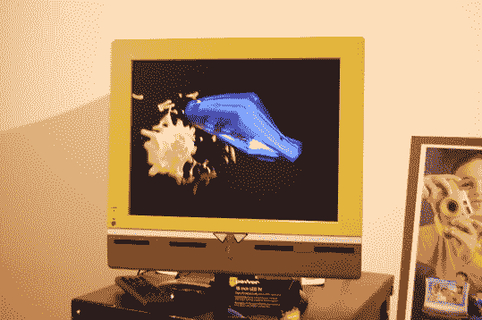
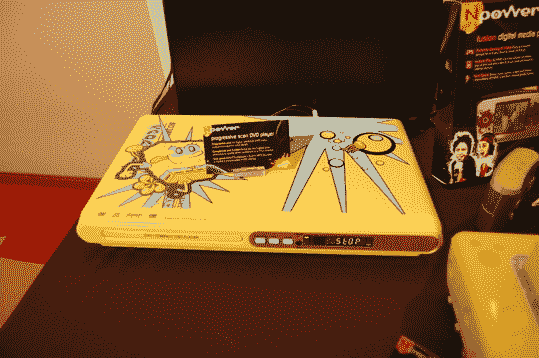
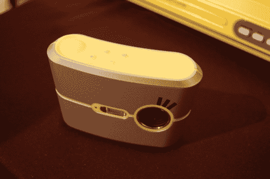
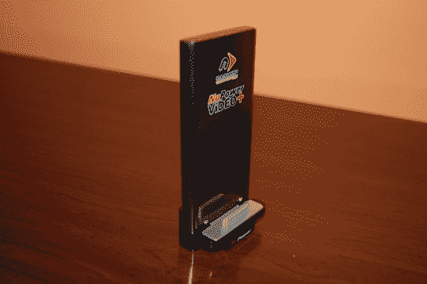
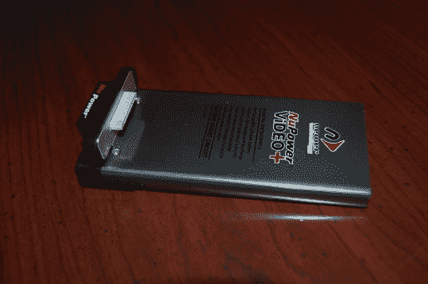
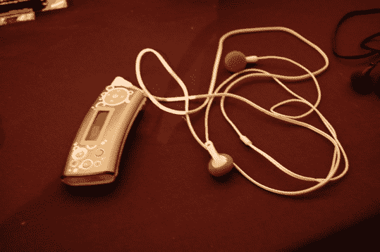
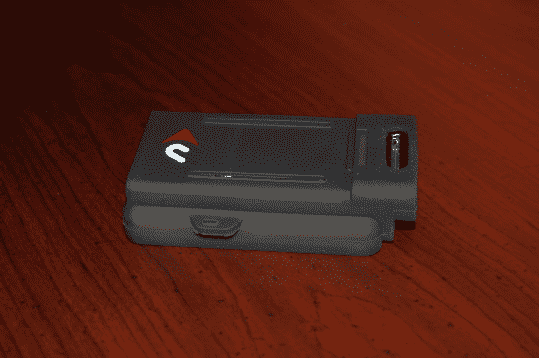

# Nickelodeon 的 NPower 电子产品系列| TechCrunch

> 原文：<https://web.archive.org/web/https://techcrunch.com/2007/09/27/nickelodeons-npower-lineup-of-electronics/>

# Nickelodeon 的 NPower 电子产品系列

昨晚是 Showstoppers 事件，通常是相当蹩脚的，充满了粗制滥造的供应商。然而，昨晚是个例外。活动背后的家伙们肯定最终意识到，使用老化的科帕卡巴纳作为场地是一个坏主意，而是选择在纽约时报大楼举办晚会。

现在你可以拥有世界上最好的场地，但如果那里的公司很烂，那还有什么意义呢？唯一一家展示新奇有趣的东西的公司是尼克国际频道。从小在尼克身边长大，我很兴奋能看到这里提供了什么。

很多电子产品都是面向《爱探险的朵拉》和《海绵宝宝》的。如你所见，有一款 13 英寸的海绵宝宝液晶电视。虽然它可能不是技术最先进的电视，但它的设计非常棒。该装置的底座被涂成了海绵宝宝的裤子的样子，屏幕周围的塑料是亮黄色的。

还有一个闹钟，闹钟响的时候海绵宝宝就会弹出来。想继续睡吗？把他的头砸下来。也不用担心会摔坏，它是由柔软的橡胶泡沫材料制成的。

Nickelodeon 也有几个 MP3 播放器，几个数码相机，和其他一些小玩意。海绵宝宝数码相机只有 300 万像素，但它的零售价不到 100 美元，可以让你自动将喜欢的角色插入照片中。

所以是的。看起来 Nickelodeon 正在重返消费电子市场。这些东西价格合理，可能会让你十几岁的儿子或女儿高兴。更重要的是，这些小玩意质量不错，打开盒子后不会摔坏。好好享受吧。

