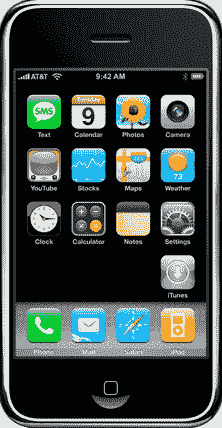

# 苹果公司注意:不要像电话公司一样思考

> 原文：<https://web.archive.org/web/https://techcrunch.com/2007/09/28/note-to-apple-stop-thinking-like-a-phone-company/>

# 苹果公司注意:不要像电话公司一样思考

我们[现在都知道](https://web.archive.org/web/20230203091733/http://www.techmeme.com/070928/h1000)了，iPhone 的最新软件更新在某些情况下可能会让它变成一块无用的砖头——如果你碰巧在上面安装了黑客软件或者解锁了它([咳咳，约翰)](https://web.archive.org/web/20230203091733/http://crunchgear.com/2007/09/28/iphone-update-111-the-aftermath/)以便让它在非 AT & T 运营商(如美国的 T-Mobile)上工作。当然，苹果可以自由地尝试将顾客锁定到它在 T 的合作伙伴，并控制哪些软件可以在手机上运行。这就是手机行业的运作方式。对吗？这一切都是为了锁定客户和减少客户流失。

但史蒂夫·乔布斯在这里可能会更好地接受自己的建议，进行不同的思考。因为，正如他用 iPhone 优雅地展示的那样，这些设备最终将变成小型电脑。因此，消费者期望它们像电脑一样工作，这并不奇怪。他们会想要修改它们，以符合他们确切的、古怪的偏好。他们会想以任何他们想要的方式使用它们，作为一个通用的设备。

这就是为什么个人电脑接管了世界。它们可以有一百万种不同的方式来适应一百万个不同顾客的需求。你不需要征得苹果公司的同意就可以从网上为你的 Mac 下载软件。你永远不会同意购买只与一家宽带提供商合作的笔记本电脑。为什么 iPhone 应该有所不同？

今天的骚动可能仅限于黑客和数字人。但是很快每个人都会想要同样的东西。如果他们没有从苹果公司获得。他们可能会去别的地方看看。[谷歌手机](https://web.archive.org/web/20230203091733/https://techcrunch.com/2007/08/28/lots-and-lots-of-google-phone-rumors/)有人吗？