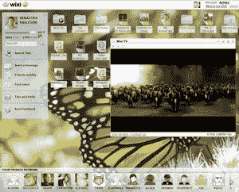

# Wixi 向我们的读者发出 5000 份邀请函 TechCrunch

> 原文：<https://web.archive.org/web/https://techcrunch.com/2007/10/01/wixi-gives-away-5000-invites-to-our-readers/>

# Wixi 向我们的读者发出了 5000 份邀请函

几周前，以媒体为中心的社交网络 [Wixi](https://web.archive.org/web/20230220120824/http://www.crunchbase.com/company/wixi) 在 [TechCrunch40](https://web.archive.org/web/20230220120824/http://www.techcrunch40.com/) 上发布，向 TechCrunch 读者发出了 5000 份私人测试版邀请。

要申领您的卡，请点击[此处](https://web.archive.org/web/20230220120824/http://main.wixi.com/signup/submission_first.php)并输入“havefun”作为 Wixi 通行卡。一旦注册，你就可以邀请你的六个朋友。在这 5000 个邀请用完之后，用户将被列入未来几批邀请的等候名单。

Wixi 用户可以获得 3GB 的免费存储空间，用于与朋友和家人分享照片、视频和音乐。虽然该服务是基于浏览器的，但 Wixi 设计的界面感觉像一个具有拖放功能的桌面环境。托管在 Wixi 上的文件可以通过 Wixi 网站访问，或者使用嵌入式 Flash 播放器显示在用户的网站上(本文底部显示了一个示例)。

该公司目前自筹资金，并计划在 12 月向公众开放。