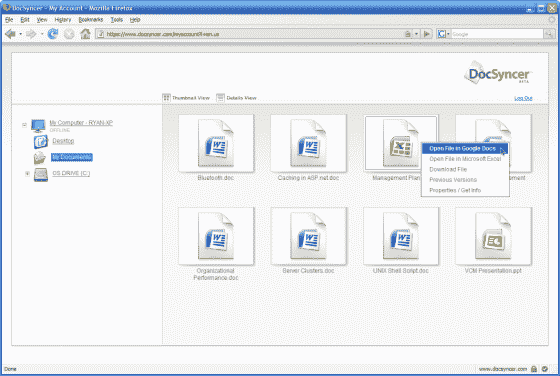

# DocSyncer 将您的桌面与 Google Docs TechCrunch 连接起来

> 原文：<https://web.archive.org/web/https://techcrunch.com/2007/10/15/docsyncer-bridges-your-desktop-with-google-docs/>

使用 Google Docs 或 [Buzzword](https://web.archive.org/web/20221209115551/http://www.beta.techcrunch.com/2007/09/30/adobe-raises-the-stakes-for-web-documents-with-buzzword-and-share/) 等 Webtop 生产力应用程序的最大缺点之一是，它们迫使你同时在两个不同的世界工作:在线世界和桌面世界。你可以一次上传一个桌面文档到这些服务上，它们会帮你转换成一个基于网络的文档，但是没有简单的方法批量上传你的文档。两个世界之间的同步比它的价值更麻烦。

一项名为 [DocSyncer](https://web.archive.org/web/20221209115551/http://www.crunchbase.com/company/docsyncer) 的新服务希望能解决这一切。DocSyncer 将在几周内推出一个仅限邀请的测试版(TechCrunch 的读者可以在这里注册获得第一次机会)。它将你桌面上的所有微软 Office 文档(Word、Excel、PowerPoint)上传到谷歌文档，然后保持同步。每当你在桌面上做出改变，这些改变都会自动反映在谷歌文档和 DocSyncer.com 的相应文件中。这项服务需要下载一个小软件，该软件最初只能在 Windows 电脑上运行(Mac 版即将推出)。但是你可以从多台电脑上同步，最多不超过 Google Doc 目前 5000 个文档的限制。

“DocSyncer 总是坐在后台，”创始人 Cliff Shaw 解释道，“监视新文档。当有新内容加入时，它会立即同步到我们的在线浏览器和谷歌文档中。”肖还是 ProtectMyPhotos 的首席执行官，该公司通过在线存储服务和 Flickr 同步你的桌面照片。目前正在寻求天使投资的 DocSyncer 也是基于同样的技术。如果你在下载应用程序后去了 DocSyncer.com，你会看到你电脑中所有文件的图标，它们的文件夹结构和你桌面上的一样:

当你点击一个文档图标时，第二个浏览器窗口会立即在谷歌文档中打开它。通过浏览器界面，DocSyncer 试图复制桌面体验。肖说:“我们的目标是建立谷歌文档的无缝桌面集成，这样使用微软 Office 的优势就开始消失了。”这是一个巨大的野心，但 DocSyncer 可以在这个方向上迈出一小步。例如，Shaw 希望从点击浏览器图标到启动 Google 文档的加载时间比启动本地安装的 Word 文档要快。他还没到那一步。我花了大约 7 到 10 秒的时间在一个我可以访问的模拟账户中打开一个文档，而打开一个 Word 文档只需要大约 3 秒(微软 Word 已经启动)。但与总是点击谷歌文档内部的后退按钮相比，它确实缩小了差距。

DocSyncer 可用于多种用途——远程访问您所有的桌面文档或进行安全的异地备份。每个文档都被单独加密，并通过安全套接字层(SSL)发送给谷歌。Shaw 的希望是让它成为下一波对 Webtop 生产力应用程序感兴趣，但不想放弃桌面文档的人的关键迁移工具(他们为什么要放弃呢？).谷歌文档需要批量上传和同步功能。只需对 Google Docs API 进行一些调整，就可以实现双向同步，这样 Google Docs 中的任何变化都会反映到桌面上的原始文档中。但我不确定这是一家独立的公司——最终要么谷歌成为 DocSyncer 的天使买家，要么它自己建立这个公司。