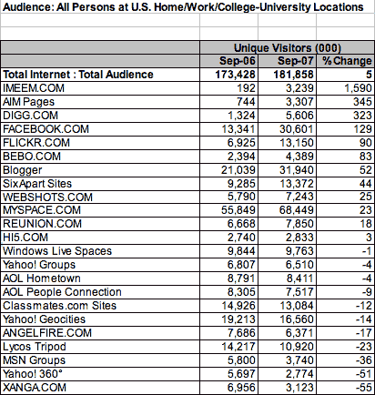
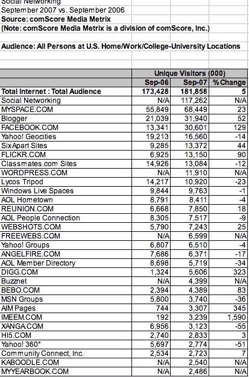

# 社交网站排名(2007 年 9 月)

> 原文：<https://web.archive.org/web/https://techcrunch.com/2007/10/24/social-site-rankings-september-2007/>

# 社交网站排名(2007 年 9 月)

您知道 [Imeem](https://web.archive.org/web/20230202031229/http://www.crunchbase.com/company/imeem) 是美国增长最快的社交网站吗(每月增长 1590%)。AIM Pages 的增长速度略快于[Digg](https://web.archive.org/web/20230202031229/http://www.crunchbase.com/company/digg)(345%比 323%？至少根据 comScore 的数据。我让 comScore 对美国的社交网站进行排名，然后按照增长速度重新排序。在这里:

这是我的外卖。 [MySpace](https://web.archive.org/web/20230202031229/http://www.crunchbase.com/company/myspace) 尽管规模庞大，但仍以健康的 23%的速度增长。但是[脸书](https://web.archive.org/web/20230202031229/http://www.crunchbase.com/company/facebook)发展迅速，增长了 129%。还要注意 [Bebo](https://web.archive.org/web/20230202031229/http://www.crunchbase.com/company/bebo) 的强劲表现(增长 83%)，而美国的 Hi5 增长乏力(3%)以及 Xanga 的下降(负 55%)。

在博客平台上，Blogger 在绝对数量(3200 万访问者比 1300 万)和增长速度(55%比 44%)上都超过了“六除一”。在低迷的领域，你可以看到 Windows Live Spaces(下降了 1%)和雅虎集团(下降了 4%)。在你应该认真考虑关闭的领域，有 Lycos Tripod(下降 23%)、MSN Groups(下降 36%)和 Yahoo 360([)nuff 说](https://web.archive.org/web/20230202031229/http://techcrunch.com/2007/10/23/yang-decides-to-shut-down-yahoo-360%e2%80%94nobody-notices/)。

这是一个更全面的按访客总数排名的社交网站列表。它包括 comScore 无法计算增长率的网站，因为它没有足够的 2006 年 9 月的数据。一些在过去一年中突然冒出来的网站在这份名单中脱颖而出，包括[WordPress.com](https://web.archive.org/web/20230202031229/http://www.crunchbase.com/company/automattic)(每月 1190 万访客)[免费网络](https://web.archive.org/web/20230202031229/http://www.crunchbase.com/company/freewebs)(660 万)、[BuzzNet](https://web.archive.org/web/20230202031229/http://www.crunchbase.com/company/buzznet)(440 万)和[Kaboodle](https://web.archive.org/web/20230202031229/http://www.crunchbase.com/company/kaboodle)(250 万)。(**更新**:另外，你会注意到谷歌的社交网站 Orkut 甚至不在名单上。这是因为，尽管 2007 年 9 月 Orkut 在全球有 2460 万访客，但它在美国只吸引了 50.3 万访客。

