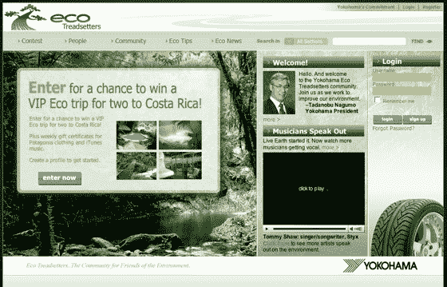

# 来自横滨的 Pringo 为社交网络提供动力 TechCrunch

> 原文：<https://web.archive.org/web/https://techcrunch.com/2007/10/31/pringo-powering-social-network-from-yokahama/>

# 来自横滨的 Pringo 动力社交网络

总部位于洛杉矶的白色标签社交网络初创公司 [Pringo](https://web.archive.org/web/20221209132705/http://www.pringo.com/) 宣布推出一个新的社交网站，致力于拯救地球和轮胎。

该网站“ [Eco Treadsetters](https://web.archive.org/web/20221209132705/http://www.ecotreadsetters.com/) ”来自横滨轮胎公司，致力于加强横滨的在线品牌，增加其用户群，并提升该公司作为“专注于保护地球的有社会意识的轮胎制造商”的地位

用户可以创建个人资料，相互交流，组成子社区，拥有个人资料页面等等，这是非常标准的社交网络功能集。用户还可以“提交他们为保护各自社区而创建的环保项目，有可能赢得奖品，包括哥斯达黎加生态之旅以及巴塔哥尼亚和 iTunes 的礼券。”

Pringo 已经离开我们的雷达有一段时间了，因为更知名的白色标签服务，如[宁](https://web.archive.org/web/20221209132705/http://www.ning.com/)得到了大多数的关注。该公司已经建立了一个令人尊敬的企业业务，为 11on11.com、CBS 电台和 ePharma 等网站提供社交网络解决方案。

当我说我从一个轮胎制造商那里看不到社交网络的吸引力时，这并不是对 Pringo 的轻视；毕竟，网站的运行没有任何问题，毫无疑问，他们得到了丰厚的报酬来管理它。长尾可能很长，但我认为在这种情况下，横滨不会获得像样的道路牵引力。

点击查看我们的白色标签社交网络提供商图表[。](https://web.archive.org/web/20221209132705/http://www.beta.techcrunch.com/wp-content/white_label_social_networking_solutions_chart2.html)

