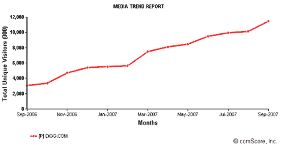

# Jay，把 Digg 卖了吧

> 原文：<https://web.archive.org/web/https://techcrunch.com/2007/11/07/just-sell-digg-already-jay/>

 在我们这个小小的科技世界里，有一件事已经成为定局——几个月过去了，仍有传言称 [Digg](https://web.archive.org/web/20230226101554/http://www.digg.com/) 即将被出售。首席执行官杰伊·阿德尔森和联合创始人凯文·罗斯陷入了无休止的谣言循环。问题是，他们似乎是谣言的罪魁祸首。原因？近两年来，他们一直在试图出售 Digg，几乎没有间断过。他们推荐的人一直在向媒体泄露消息。
 **谣言历史**

*   博主 Kevin Burton 是臭名昭著的第一个发表声明说 Digg 在 2006 年 1 月以 3000 万美元的价格卖给雅虎几乎是板上钉钉的人(他错了)。
*   我们非常肯定地知道，Digg 确实在 2006 年 5 月试图以 2000 万美元或更多的价格将自己出售给雅虎，或许还有其他公司。根据我们的消息来源，没有报价。
*   到 2006 年底，价格上涨了——他们[要价](https://web.archive.org/web/20230226101554/https://techcrunch.com/2006/10/24/digg-does-the-acquisition-dance-with-news-corp/)150 美元，并拒绝了 1 亿美元左右的软报价。当时，康姆斯克说他们只有 130 万用户。
*   我们从潜在买家那里得到证实，Digg 在 2006 年和 2007 年初一直在谈判，希望至少获得 1 亿美元，但是没有人出价。
*   在过去的几个月里，Digg 又开始自己购物了——据一位知情人士透露，价格至少为 2 亿美元。再说一次，没有报价。
*   现在，我们得到[报告](https://web.archive.org/web/20230226101554/http://valleywag.com/tech/rumormonger/digg-close-to-a-300-million-sale-320145.php)说即将出售，价格在 3 亿美元以上。一位接近 Digg 的消息人士称，他们对此一无所知。这并不意味着它没有发生。但是我们没有独立的信息表明这一次，谣言是真的。

**雇用银行家。已经把这东西卖了。**

在过去，阿德尔森一直表示，他们从未试图出售 Digg。他说，他们会在被接洽时与公司会面，但他们永远不会是试图达成交易的一方。问题是，太多的独立消息来源告诉我们，Digg 已经努力不懈地尝试向他们出售产品。该公司已上市近两年。这是无法否认的。

坦白说，我不明白他们为什么这么急着卖。他们已经在使用上有了转机——今天大多数的提交和流量都是基于非技术的故事。有一个真正的论点是，Digg 可以成为主流的新闻分类服务。康姆斯克向他们展示了每月 1150 万的独特性，有一个很好的增长曲线(见下文)。

当 Digg 继续像杂草一样生长时，没有理由卖掉它。但这似乎并没有阻止阿德尔森和罗斯试图在每一个机会甩掉这个东西。然而，他们的要价总是高于人们愿意支付的价格，而且他们也没能制造出一场哄抬价格的竞价战。

也许最近的谣言是真的。如果是的话，我祝贺 Digg 团队和投资者 T2。但如果传言和之前的一样真实(意思是完全不真实)，那么我建议他们聘请一位投资银行家来整理一份合适的推介材料，接近关键买家，开始一场真正的竞购战。这就是以[荒谬的估值](https://web.archive.org/web/20230226101554/https://techcrunch.com/2006/08/22/wow-grouper-sells-for-65-million/)出售公司的方法。缓慢燃烧的方法除了制造永无止境的谣言循环之外，什么也做不了。