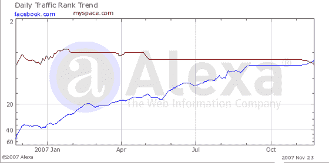

# Alexa 的虚拟互联网 TechCrunch

> 原文：<https://web.archive.org/web/https://techcrunch.com/2007/11/25/alexas-make-believe-internet/>

# Alexa 的虚拟互联网

亚马逊的 Alexa 交通报告服务在关注交通趋势的人中几乎没有可信度。大多数分析服务，如康姆斯克，并不能很好地衡量小网站，但他们倾向于为较大的网站做好准备。Alexa 似乎把所有事情都搞错了，不管这个网站是大是小。

例证:8 月，Alexa 表示，YouTube 的总浏览量已经超过了谷歌。他们错了，但是他们的数据[继续](https://web.archive.org/web/20221102223621/http://www.alexa.com/data/details/traffic_details/downloadhelper.net?site0=youtube.com&site1=google.com&y=p&z=3&h=300&w=610&range=3y&size=Medium)延续这个交替的现实。

现在，又一个令人尴尬的错误。Alexa 说，脸书在过去的两年里稳步增长，现在拥有比 MySpace 更多的用户。这不像 YouTube/Google 的错误那样荒谬，但也差得很远。康姆斯克说，全球 MySpace uniques 每月有 1.09 亿用户，而脸书是 8600 万。Compete.com 使用与 Alexa 类似的技术测量流量，stills 说 MySpace 比脸书大。

感谢提示[马克](https://web.archive.org/web/20221102223621/http://customize.org/)。