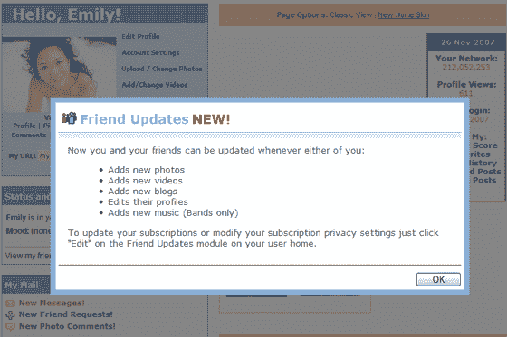

# 即将到来的 MySpace“新闻订阅源”的截图和细节“|技术危机”

> 原文：<https://web.archive.org/web/https://techcrunch.com/2007/11/26/screenshots-and-details-on-upcoming-myspace-news-feeds/>

  路透社[今天早些时候的一篇文章](https://web.archive.org/web/20230222100553/http://www.reuters.com/article/MediaandCommunications07/idUSN2641609120071126)详细介绍了 MySpace 即将推出的“新饲料”产品(脸书称其为一年前推出的[类似产品](https://web.archive.org/web/20230222100553/https://techcrunch.com/2006/09/05/new-facebook-redesign-more-than-just-aesthetics/))。我们与 MySpace 交流，深入了解了该产品，以及它的截图。

MySpace 称，这款名为“好友动态”的新产品将于本周四开始向用户发布。来自新西兰和爱尔兰的用户已经可以使用它了，朋友更新正在那里进行测试。

新产品将为用户提供来自朋友的源源不断的事件信息。个人资料更新、博客帖子和照片/视频上传都会被注意到。查看右边的截图(点击查看更大的视图)。

我的空间产品副总裁史蒂夫·皮尔曼告诉我，周四发布的产品只是第一次迭代；他们计划在未来 18 个月内发布额外的功能。

 **与《脸书新闻提要》的主要区别**

脸书新闻源和我的空间好友动态之间有很多关键的区别。该产品的一个重点似乎是不激怒用户。其他差异允许对新闻发布进行更精细的控制。

只有当用户登录并查看了通知他们更改的间隙页面后，我的空间才会开始收集他们的信息——在他们看到并单击该间隙页面之前，不会为朋友更新收集任何信息。用户还可以链接到一个设置区域，在那里可以更改默认选项，也可以完全退出。这将有望帮助 MySpace 避免脸书在发布新闻订阅后不久面临的用户反弹。

用户还可以更精确地控制谁可以看到数据。可以选择特定的朋友不接收更新。皮尔斯曼举例说明，当你把状态改为“单身”时，不一定想让你的女朋友知道(尽管快速浏览一下个人资料无论如何都会让她知道)。用户还可以从一个或多个信息类别中进行选择以共享。

这个过程归结为一个要求双重肯定——你必须同意与特定的朋友分享，他们也必须同意订阅。没有双方同意，信息不会出现。

Pearman 说，预计在不久的将来，第三方应用程序会访问新闻提要。他表示:事实上，这是他们开发该产品的关键原因之一。