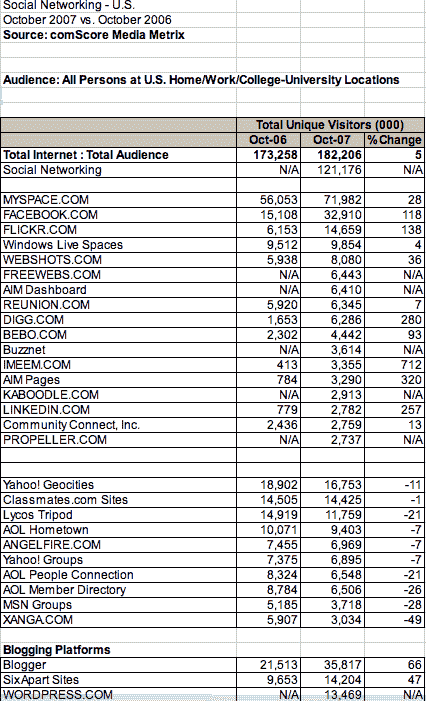

# 社交网站排名(2007 年 10 月)

> 原文：<https://web.archive.org/web/https://techcrunch.com/2007/11/28/social-site-rankings-october-2007/>

# 社交网站排名(2007 年 10 月)

上个月，我让 comScore 对社交网站(comScore 称之为社交网站，但它们并不都是社交网络)的流量进行了统计。这个月，我让他们在 2007 年 10 月再做一次同样的测试。以下是结果，显示了美国的绝对流量和百分比变化，其中 2006 年 10 月的可比数据可用。这次我把它们组织得有点不同。显示同比增长的网站属于第一类(脸书、Flickr、Digg)，显示同比下降的网站属于第二类(Geocities、MSN Groups、Xanga)，博客平台属于第三类，因为我认为它们完全是一个独立的群体:

【T2

一些要点:

LinkedIn、Digg、Flickr、脸书、Imeem 和 AIM 网页的年增长率都超过了 100%。
——Wordpress 也在蓬勃发展，仅上个月就获得了 160 万独立访客，超过了 Six Apart 一个月 80 万的增幅，但仍落后于 Blogger 的 390 万(见[上个月的帖子](https://web.archive.org/web/20221209125220/http://www.beta.techcrunch.com/2007/10/24/social-site-rankings-september-2007/)中的可比数字)。美国在线的 Propeller(它的 Digg 克隆版)表现好于预期，访客数量几乎与 LinkedIn 持平。