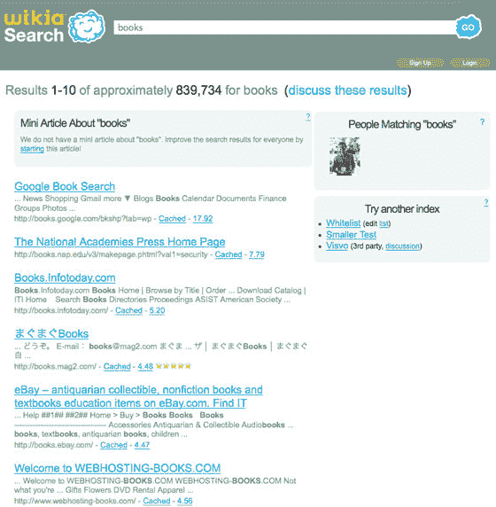

# 维基搜索完全令人失望。TechCrunch

> 原文：<https://web.archive.org/web/https://techcrunch.com/2008/01/06/wikia-search-is-a-complete-letdown/>

当吉米·多纳尔·威尔士的宣传机器许诺一个人力搜索引擎可以与谷歌抗衡时，我们中的许多人已经等了一年(T2)。今晚，搜索引擎在 alpha.search.wikia.com 启动，这可能是我不愉快地回顾的最大失望之一。

首先，它根本算不上一个搜索引擎。它基于开源的 Nutch 软件，包含了由 Grub(Wikia 去年收购的一家公司)创建的网页索引。如果不是因为已经设定的巨大期望，搜索结果是贫乏和单薄的。绝对没有人会用它来搜索网页，除非(如果)它有很大的改进。

但除了糟糕的搜索结果，这个引擎真的没有任何“人”的因素。Wikia 首席执行官 Gil Penchina 表示，这一功能将在以后推出。目前，用户可以在个人资料中添加关键词——他们感兴趣的东西，等等。当其他人用这些词进行搜索时，用户的照片会显示在右边一栏。最终，用户将能够编辑和改进他们感兴趣的搜索结果。但目前，用户所能做的只是在他们的个人资料中添加他们可能有一天会感兴趣的关键词，和/或为出现在查询搜索结果顶部的“迷你文章”做出贡献([示例](https://web.archive.org/web/20230220235140/http://alpha.search.wikia.com/search/search-a.html#paris%20hilton))。

还有那些资料。[正如预期的那样](https://web.archive.org/web/20230220235140/https://techcrunch.com/2007/12/23/wikia-search-in-2007-or-not-jimmy-wales-say-yes/)，维基搜索是又一个社交网络。用户资料包括照片、添加好友、兴趣和技能信息等基本元素。直接抄袭脸书，维基搜索档案包含了你和你的朋友最近的活动。

即使没有我们不得不忍受的大规模宣传，维基搜索也会令人失望。考虑到这种宣传，这种产品是不可原谅的时间浪费。

公平地说，首席执行官吉尔·潘奇纳警告我，这不会是一个伟大的产品发布。他说，这只是一个概念证明，证明使用开源软件和很少的钱可以创造出什么。很公平。但是威尔士是时候安静下来了，让这个东西进化或者不进化，最终让软件来说话。最终，Wikia 将向第三方提供该索引。但指数需要相当不错，才会有人想要。维基还有很长的路要走。

**更新:**下面的评论里好争论，包括一对来自吉米·多纳尔·威尔士的夫妇。

