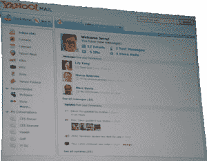
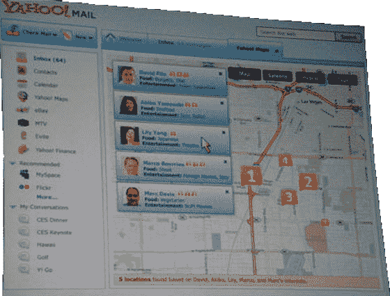

# 雅虎生活来了，我是说雅虎生活技术危机

> 原文：<https://web.archive.org/web/https://techcrunch.com/2008/01/08/here-comes-yahoo-live-i-mean-yahoo-life/>

 雅虎不仅仅是在今天的消费电子展上宣布了他们新的开放移动平台。他们还邀请了重量级人物——杨致远和大卫·费罗——上台为他们称之为“雅虎生活”的项目提供更多细节。(之前称为“[收件箱 2.0](https://web.archive.org/web/20230125021626/http://blogs.zdnet.com/BTL/?p=7503) ”)。 *[ **更新**:雅虎发言人澄清称，尽管杨一直在谈论“生活！”在舞台上，这个项目实际上并不叫这个。它没有被称为任何东西。所以我们称之为雅虎生活！以区别于当前版本的雅虎邮箱。]*

如今，每个人都想变得更像脸书，雅虎也不例外。谷歌的策略是[开放社会](https://web.archive.org/web/20230125021626/http://techcrunch.com/2007/10/30/details-revealed-google-opensocial-to-be-common-apis-for-building-social-apps/)，这是一套开放的 API，允许第三方在其他第三方上嵌入内容。谷歌开放社会的基石是 Gmail，所有的行为都发生在一个用户身上(其次是 Orkut 和 iGoogle)。雅虎似乎也在朝着同样的方向前进，将雅虎邮箱作为他们新社交网络战略的中心。

杨说，在这一点上，新产品只是一个[概念的证明。目标是联合邮件、搜索等服务。在一个以雅虎邮箱为中枢的社会框架下。您的电子邮件和 Im 联系人作为您的联系人并填写社交图。他们与你的亲密程度取决于你与他们交流的频率。](https://web.archive.org/web/20230125021626/http://bits.blogs.nytimes.com/2008/01/07/yahoos-quest-to-open-up/)

丹·法伯举了一个例子:

> 他举了一个为 CES 计划晚餐的例子。你可以把这条线拖到一张地图上，它会显示出邮件上的个人资料，注意偏好(这里是食物)，并建议这个地区的餐馆。您也可以接收一封电子邮件，弹出邮件中的个人资料，从电子邮件中获取一个地址，并向其显示一张地图。

第三方应用程序也没有被遗漏。例如，上图清楚地显示了与 MySpace 的集成。这就是雅虎在 2007 年末以 3.5 亿美元收购 Zimbra 的野心变得更加明显的地方。开发者的新平台部分基于 Zimbra 的技术。

早在 2006 年末，当雅虎开始推出雅虎邮箱和即时通讯的[整合时，这一战略的第一部分就已经就位。消息现在可以在即时消息和电子邮件之间无缝地来回传输，这是其他网络邮件应用程序无法做到的。很明显，即使在那时，雅虎也在长期考虑邮件界面的未来。](https://web.archive.org/web/20230125021626/http://techcrunch.com/2006/11/09/single-ajax-interface-for-yahoo-mail-im-coming/)

不幸的是，在社交网络方面充其量只是有一个“T4”混乱的过去的雅虎，却把这个产品称为“生活”这与微软的 Live 战略“T7”非常接近，即在一个新品牌下对抗在线服务。在过去的几年里，这种趋势一直在横向发展，并表明重新包装和营销对推动用户在当今互联网中的采用没有什么作用。

但撇开名字不谈，尽管我之前批评过，对雅虎来说，雅虎生活看起来像一个智能的社会架构。假设所有这些社交网络的东西不仅仅是一种时尚(事实并非如此)，那么雅虎在这场斗争中集中资源是有意义的。当然，除了现在存在的脸书和谷歌平台之外，开发者现在还有另一个平台要建。

所有图片均由 [Dan Farber](https://web.archive.org/web/20230125021626/http://blogs.zdnet.com/BTL/?p=7503) 提供。

