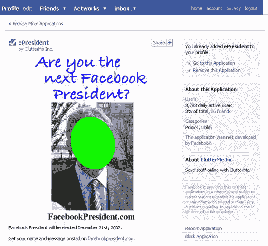

# 法国媒体陷入脸书重大恶作剧 TechCrunch

> 原文：<https://web.archive.org/web/https://techcrunch.com/2008/01/09/french-press-falls-for-major-facebook-prank/>

# 法国媒体相信脸书少校的恶作剧

这可能是脸书历史上最大的骗局。这件事发生在法国，是目前法国博客圈讨论最多的故事之一。这一切都始于几周前一个简单的第三方脸书 T2 应用程序，旨在每个季度指定一位新的“脸书全球总裁”。一个名叫 Arash Derambarsh 的 28 岁法国年轻人决定竞选总统，他相信这是一场真正的选举(或者假装相信),并开始邀请他的朋友，甚至创建了一个[官方项目](https://web.archive.org/web/20230213061301/http://www.facebookpresident.com/):鼓励跨宗教宽容，消除文盲，并在世界范围内推广法国文化。在那之前，没有什么真正值得谈论的。

但关键在于:Arash 登上了应用程序的顶端，成为了“总统”(根据记录，在第一次会议期间，该应用程序已经被安装了 140，000 多次，而“候选人”正式获得了 9，000 多张选票..).他利用这一信息，得到了一些法国媒体的报道，这些媒体开始报道这一新闻，他真的相信一个法国人已经成为脸书新的全球总统，甚至没有花时间验证事实或理解这个标题意味着什么。

然后，恶性循环开始了，非常严肃的电视频道和传统媒体一个接一个地报道了这个故事:TF1、LePoint、L'express、FranceInter、Le Parisien……他们都提到了这个故事，就好像这是真的一样:[自己看看](https://web.archive.org/web/20230213061301/http://arretsurimages.net/contenu.php?id=196)。Arash 突然成为法国的一个明星，在[维基百科](https://web.archive.org/web/20230213061301/http://fr.wikipedia.org/wiki/Arash_Derambarsh) ( **更新**:现在是 [Mahalo](https://web.archive.org/web/20230213061301/http://www.mahalo.com/Facebook_president) 条目)上获得了他的页面，并被邀请谈论他的总统任期和他的计划几天；公众舆论支持他。这家伙能言善辩，有一些政治记录，最后听起来可信。

当然，脸书与此无关，但尽管如此，在一些采访中，阿拉什暗示他有一个与联合国教科文组织有关的项目以及一些来自脸书的支持；他甚至宣称，通过脸书的一个秘密功能，他有能力接触到近一亿用户，比法国总统本人还多。没有人会犹豫。每个人都买它，虽然这是真的很容易事实检查，脸书没有接近一亿的用户，甚至更容易与脸书的新闻部验证这个故事的真实性。Arash 其实就是 FakeBook 的总裁。

但是脸书用户不是傻瓜，一个 T5 团体出现了，谴责整个事情。ZDnet France [发现了这个骗局，博客们迅速跟进，真相大白。根据 ArretsurImages 的调查，许多记者报道新闻只是因为其他人报道，因为“总统”看起来可信。然后最后一波新的文章回到了这个故事，解释这是假的，Arash 误解了这次选举的目的。当然，这已经太晚了，法国媒体已经被愚弄了。](https://web.archive.org/web/20230213061301/http://www.zdnet.fr/blogs/2008/01/03/un-president-pour-facebook-ou-la-belle-arnaque-du-debut-2008/)

许多人试图联系 Arash 了解更多细节和反应，但没有成功。他这样做纯粹是出于算计，还是他的自负造成了整个故事？最重要的一点:一个简单的用户设法制造了脸书历史上最大的恶作剧，媒体相信了。令人捧腹、可笑，但也让法国媒体(很大一部分)感到担忧和悲伤，因为它们的可信度已经受到重创。