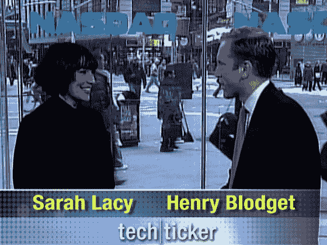

# 雅虎科技股票:更多细节和截图

> 原文：<https://web.archive.org/web/https://techcrunch.com/2008/01/09/yahoo-tech-ticker-more-details-and-a-screenshot/>

# 雅虎科技股票:更多细节和截图

雅虎新的[技术商业视频秀，TechTicker](https://web.archive.org/web/20230216005147/https://techcrunch.com/2007/12/04/yahoo-techticker-to-go-after-cnbc-crowd/) ，即将上线(官方消息，在接下来的几周内，但我听说一些早期的东西可能会在下周发布)。

该节目将由[亨利·布洛杰特](https://web.archive.org/web/20230216005147/http://www.alleyinsider.com/)(硅谷内幕人士)[莎拉·莱西](https://web.archive.org/web/20230216005147/http://www.sarahlacy.com/)(商业周刊专栏作家)和[保罗·凯德罗斯基](https://web.archive.org/web/20230216005147/http://paul.kedrosky.com/)主持，每周将有 10-20 个原创片段，关注金融新闻和美国消费者新闻与商业频道人群。

截屏开始泄露，我确定，这是莱西和布洛杰特在热情拥抱之前的照片。请继续关注更多发布信息。同时，继续看[墙条](https://web.archive.org/web/20230216005147/http://www.wallstrip.com/)。