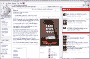
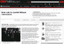
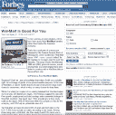
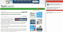

# Proximic 与雅虎和易贝签署协议，将产品列表转化为情境广告；挑战 AdSense | TechCrunch

> 原文：<https://web.archive.org/web/https://techcrunch.com/2008/01/15/proximic-signs-deals-with-yahoo-and-ebay-to-turn-product-listings-into-contextual-ads-taking-on-adsense/>

 慕尼黑一家名为 [Proximic](https://web.archive.org/web/20230306013307/http://www.proximic.com/) 的 14 人创业公司想要和谷歌一较高下。但它并不打算进行搜索。它从后面攻击 AdSense。Proximic 已经签署协议，将来自易贝的 Shopping.com 和雅虎的购物网络的产品列表整合为其他网站上的上下文广告。

这是雅虎或易贝首次联合上市。Proximic 将一举获得 5000 万个广告的广告库存(易贝和雅虎各 2000 万个，其他来源 1000 万个)。Proximic 估计，相比之下，谷歌拥有大约 100 万条独立广告。Proximic 基于这一庞大库存的广告网络将于 1 月底推出。

未来的网络出版商将能够在他们的网站上放置一个[广告插件](https://web.archive.org/web/20230306013307/http://www.proximic.com/en/publisher-widget.html)。Proximic 将对网站进行索引，并以文本广告的形式提供上下文匹配的产品以及上下文相关的内容链接(见下面的演示截屏)。广告和上下文相关的网页链接也会出现在侧边栏中，供下载了 Proximic [Firefox 插件](https://web.archive.org/web/20230306013307/http://www.proximic.com/en/browser-add-on/overview.html)的用户使用。

因此，如果你正在阅读中东和平努力，关于中东的书籍可能会出现在广告窗口小部件中。如果你正在阅读 Mozilla 基金会的资料，你可能会从 Mozilla 商店得到一个 Firefox track jackets 的广告，以及一个关于 Mozilla [从 Humanized](https://web.archive.org/web/20230306013307/https://techcrunch.com/2008/01/15/breaking-mozilla-buying-humanized/) 雇佣这些人的 Twitter 消息的链接。(这是我在 Firefox 侧边栏中实际出现的内容。Proximic 还用它索引的 900，000 个 RSS 源和前 500 个左右的网站的内容链接填充它的小部件结果。)

Proximic 的与众不同之处在于，它不会像谷歌或雅虎那样，根据关键词搜索得出上下文匹配。它也不使用语义或统计方法来判断一个页面是关于什么的。“语义系统无法扩展，”Proximic 的联合创始人兼首席技术官、前计算机国际象棋冠军 Thomas Nitsche 嗤之以鼻。“如果你持有超过一百万份文件，你就会遇到问题，”他总结道。他认为，语义搜索在这一点上对于广告服务来说太慢了。

Proximic 使用邻近分析，而不是关键字、语义或统计方法。Nitsche 对它的工作原理含糊其辞，但它归结于 Proximic 的算法，将每一段文本翻译成一种字符模式，然后用一个数学向量表示。匹配是通过传统的向量分析完成的。或者，正如尼彻所解释的:

> *我们看字母的图案。我们得到了侧写。轮廓是一个矢量。我们比较两个向量，并通过模式距离计算邻近度。我们可以产生文本之间的接近度。文本可以是一个单词、两个单词、15 个单词或一整页。*

使用这种方法，Proximic 还可以在产品列表和网页之间创建匹配，从而将现在的产品搜索结果清单开放给上下文广告世界。Nitsche 说，在测试中，Proximic 的点击率高达 1.5%，远远高于 AdSense 活动通常的 0.25%或更低的点击率。当然，Proximic 必须与雅虎和易贝以及网络出版商分享广告收入。Proximic 计划在易贝和雅虎提成后，给参与网站 70%的收入，只给它一小块蛋糕。弥补的唯一方法是提高点击率(通过提高广告的相关性)。

对于一家 2006 年仅从 Wellington Partners 融资 300 万欧元的德国初创企业来说，这是一项雄心勃勃的事业。但 Proximic 试图做的是将上下文搜索广告与联盟营销结合起来。通过分析页面上的字符模式，它正在创造一种机器智能。好的一面是 Proximic 不需要在任何人的浏览器上留下 cookies 或者在网上跟踪你。它根据你正在阅读的内容，对什么是上下文相关的做出自己的判断。

如果 Proximic 成功匹配相关产品，想象一下它作为通用搜索引擎能做什么？但是 Nitsche 知道最好不要在搜索领域与谷歌正面交锋。他很高兴，目前专注于广告方面。

