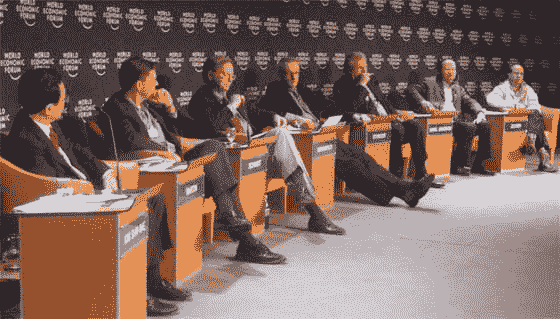

# 达沃斯超级小组:移动技术的未来 TechCrunch

> 原文：<https://web.archive.org/web/https://techcrunch.com/2008/01/25/super-panel-at-davos-the-future-of-mobile-technology/>

《财富》杂志资深编辑大卫·柯克帕特里克今天下午在达沃斯主持了一场名为[移动技术的未来](https://web.archive.org/web/20221209132857/http://www.weforum.org/en/events/AnnualMeeting2008/Programme/index.htm?id=22863)的精彩会议。小组成员包括谷歌首席执行官埃里克·施米特、联邦通信委员会主席凯文·帕丁、索尼首席执行官霍华德·斯金格爵士、NBC 环球首席执行官杰夫·朱克、SK 电讯首席执行官金新培和中国移动首席执行官王建宙。

Kirkpatrick 试图将话题引向亚洲移动业务的增长(中国移动主导中国市场，每月新增 600 万移动用户，SK 电讯主导韩国市场，市场份额超过 50%)，以及移动广告收入的黯淡前景。他引用 Forrester 的话说，即使到 2012 年，美国移动广告市场预计仍将低于 10 亿美元。他说，如今，只有 3%的互联网广告商在移动设备上投放展示广告。

**谷歌安卓和移动引爆点**

施密特淡化了营收预期，称移动业务尚未达到临界点。他说，当明年左右出现这种情况时，这些收入预测将会非常低。他说，他对谷歌新的安卓平台的目标是帮助市场达到那个临界点，并在这个过程中从移动广告中赚钱。

施密特还认为，移动设备可能比个人电脑更有趣，因为它们已经或将会拥有 GPS 和其他功能，允许新类型的应用程序，以及基于位置的广告。他说，关键是新服务将在一个开放标准的开放平台上(当然是 Android)，并且新的 700MHz 频谱规则允许这一点。他说，这为移动领域的“巨大革命”创造了条件。没有它，我们就封闭了网络“孤岛”

**亚洲增长:移动设备成为人性的延伸**

中国移动首席执行官王建宙指出，他们今天在中国有 3.17 亿移动客户，总市场是 5 亿用户。他说，人们正在使用移动设备作为自己的延伸，通过语音和短信联系他人，如果一个人没有手机，他们将缺乏作为人的基本功能。

他的公司每月新增 600 万用户。当被问及是否考虑在中国以外扩张时，他回答说，他们在那里有如此大的增长潜力，所以他们完全专注于那个市场。

**NBC 在移动领域看到了美元的迹象，索尼却不这么认为**

斯特林格(Sony)和扎克伯格(NBC)都想向移动用户出售内容，但他们对这种做法的效果有很大分歧。

Zucker 对目前支离破碎的美国市场表示遗憾，但似乎很乐观，他们将来能够有效地移动他们的商品(特别是短片)。他还表示，收入分成需要大幅改变——如今，内容创作者只能获得销售收入的 10%,而绝大部分收入都流向了运营商。他说，竞争和开放将改变这种情况。

斯特林格就不那么乐观了，他举例说，中国消费者不买内容，只买空白 CD。“抓住内容的价格不放不是一件容易的事，”他说，并补充了一句俏皮话:“当现状失去了它的地位，而你还在维护现状时，你就有麻烦了。”斯金格极具魅力和娱乐性，但他的苦恼却表露无遗。当有人问他新的索尼有机发光二极管屏幕技术何时能以合理的价格应用于移动设备时，他提到了高昂的生产成本，并开玩笑说“在消费电子设备上盈利是我们的目标之一。”

**FCC 为其妥协辩护**

联邦通信委员会主席凯文·帕丁为他们最近做出的部分开放移动市场的决定辩护，但是拒绝了谷歌要求的许多关键规则。

比如，要求网络运营商以批发价向其他人出售接入权会降低他们“维护管道”的动机。他说，基础设施投资是关键，强制开放网络可能会损害该行业。

我问马丁，谷歌的公开信是否对他和他的委员们施加了压力，要求开放频谱规则。他说没有，并引用了更多的私人压力，以保持现有运营商的事情静止不动。他说，这确实给了他一个工具，帮助说服他的委员们至少部分开放。