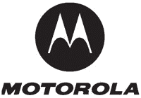

# 摩托罗拉可能分拆移动设备部门:iPhone 的第一个受害者？TechCrunch

> 原文：<https://web.archive.org/web/https://techcrunch.com/2008/01/31/motorola-may-spin-off-mobile-devices-unit-iphones-first-casualty/>

# 摩托罗拉可能分拆移动设备部门:iPhone 的第一个受害者？

摩托罗拉[正在探索](https://web.archive.org/web/20221006001103/http://biz.yahoo.com/prnews/080131/aqth164.html)剥离其移动设备部门，“以夺回全球市场领导地位并提高股东价值”

这一举动发生在一个越来越紧张的市场上，苹果在头 12 个月里占据了智能手机市场 19.5%的份额，全球定位系统提供商 Garmin 宣布了一款新的 iPhone 风格的设备，今年晚些时候将有一系列 Android 手机上市，其中至少包括电脑制造商戴尔的一款手机。

面对现有的竞争，摩托罗拉手机市场份额持续下滑，手机部门在 2007 年第四季度录得 12 亿美元的亏损。

虽然移动电话可能仍然是摩托罗拉的公众形象，但该公司也是商业、政府和军队通信工具的企业提供商。

我们将摩托罗拉的手机置于死亡池监控中。摩托罗拉在剥离公司方面有着好坏参半的记录，飞思卡尔半导体公司取得了成功，然而铱星公司看到了曾经是世界领先的商业卫星网络在 1999 年申请破产。一家以亏损 12 亿美元的业务部门为基础的新公司在正常情况下将需要一些认真的工作才能扭转局面，但在一个将出现大量新竞争对手的市场，以及像苹果这样的新来者能够在如此短的时间内占据如此大的市场份额，这将再次变得更加困难，如果不是几乎不可能的话。