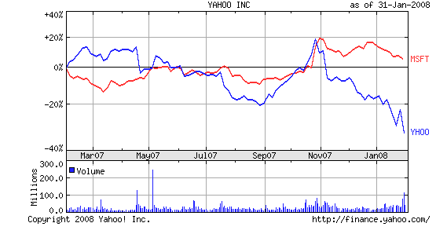
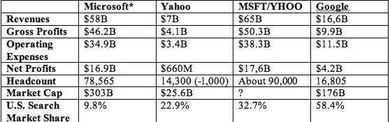
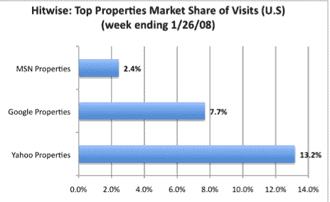
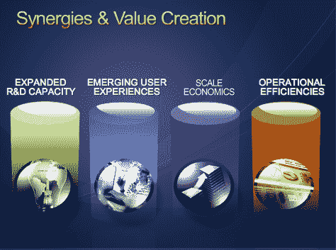

# 合并后的微软-雅虎会是什么样子？TechCrunch

> 原文：<https://web.archive.org/web/https://techcrunch.com/2008/02/01/what-would-a-combined-microsoft-yahoo-look-like/>

微软以每股 31 美元的价格收购雅虎(T4)是因为雅虎股价下跌(一年前雅虎股价约为 31 美元)。虽然雅虎过去拒绝了微软的请求，但随着特里·塞梅尔昨天辞去董事会主席一职，这次情况可能会有所不同。我快速计算了一些数据，看看微软和雅虎合并后的财务状况，以及与谷歌的对比。

 
*微软的数据是连续四个季度的，员工人数是从 6 月份开始的。comScore 的搜索数据。

这些员工人数和运营费用可能会大幅削减。微软表示，合并后的公司至少可以节省 10 亿美元的运营费用。

然而，对微软的真正影响在这些数字中看不到，因为雅虎代表了微软在广告收入和在线服务方面的新增长机会。在过去的四个季度中，微软在线服务(MSN、Windows Live、aQuantive 等)的收入。)为 28 亿美元，亏损 9.49 亿美元。因此，仅仅是将雅虎与该业务合并，你就能获得 98 亿美元的收入，但微软仍将显示该业务净亏损 2.89 亿美元。

但这是微软的一场广告战。它希望将其最近收购的广告网络的规模与雅虎的规模结合起来，以及雅虎庞大的消费者覆盖面(这对广告商很有吸引力，他们将所有这些眼球视为有价值的库存)。

在解释这笔交易的电话会议上，微软首席执行官史蒂夫鲍尔默总法律顾问布拉德史密斯兴高采烈地指出，虽然其他公司可能会竞购雅虎，但有一家公司显然不会是谷歌。鲍尔默引用了全球付费搜索广告市场 75%的市场份额，声称“谷歌被反垄断法阻止收购雅虎。”(他应该知道，他确实有一些反垄断法的经验)。在电话会议的最后，首席执行官史蒂夫·鲍尔默表示，此次收购背后的另一个驱动力是将微软推向一个更加基于网络的软件即服务公司:

> *Windows 用户想要直播。将会有一个 Windows Live。会有一个办公室直播。*

雅虎在这一领域显然有一些优势，它继续发展雅虎邮箱，[收购 Zimbra](https://web.archive.org/web/20230124223733/http://techcrunch.com/2007/09/17/breaking-yahoo-acquires-zimbra-for-350-million/) ，以及其他举措。

**更新**:以下是 Hitwise 关于雅虎和 MSN 网站综合访问量的一些数据[。这两家公司在美国互联网流量市场的份额合计为 15.6%，而谷歌地产的份额为 7.7%。但是谷歌仍然拥有雅虎和微软搜索市场份额的两倍。](https://web.archive.org/web/20230124223733/http://weblogs.hitwise.com/bill-tancer/2008/02/microsoft_and_yahoo_putting_th.html)

