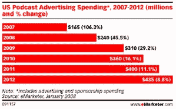

# 播客再次腾飞:eMarketer TechCrunch

> 原文：<https://web.archive.org/web/https://techcrunch.com/2008/02/04/podcasts-taking-off-again-emarketer/>

# 播客再次起飞:eMarketer

eMarketer 今天发布了一些有趣的新数据，显示播客的流量和收入都在起飞，前景再次变得更加美好。

对播客的普遍看法是，当视频成为热门垂直领域时，它已经过时了，特别是当早期的 iPod 让位于支持视频和音频的新播放器时。这些数字表明，播客行业仍有很大的增长空间。

根据 eMarketer 的数据，2007 年美国播客观众总数为 1850 万，2012 年将上升到 6500 万。“活跃听众”(定义为下载一个以上播客的人)2007 年为 650 万，预计 2012 年将达到 2500 万。

这些收入数字会让任何在该领域投资的风投公司喜笑颜开。2007 年的广告收入达到 1.65 亿美元，预计 2012 年将增长到 4.35 亿美元。

一个有趣的观点是 eMarketer 将增长归因于主流媒体推广的播客。他们没有添加的是，今天 iTunes 上的许多全球顶级列表也有这些来源的强大存在；虽然对播客的更多认识正在扩大播客的整体市场，但主流媒体正在分走一大块蛋糕。