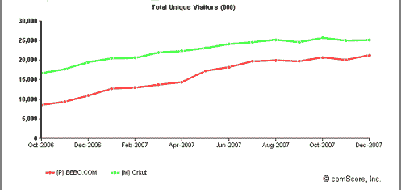

# 传闻:谷歌是否即将以 10 亿至 15 亿美元收购 Bebo？还是会是 MySpace？TechCrunch

> 原文：<https://web.archive.org/web/https://techcrunch.com/2008/02/06/rumor-is-google-about-to-buy-bebo-for-1-billion-to-15-billion-or-will-it-be-myspace/>

 一个未经证实的传言浮出水面，谷歌或 MySpace 即将宣布在社交领域进行一笔 10 亿至 15 亿美元的大收购。在与多个行业消息来源核实后，我们得出结论，如果谣言是真的，最有可能的候选人是 [Bebo](https://web.archive.org/web/20230217001901/http://www.bebo.com/) ，我们被告知它正在筹集资金，同时再次四处采购。我们认为这个谣言有 50%的可能是真的。**更新**:使其成为一个稳固的*51%的*。

需要澄清的是，围绕 Bebo 作为收购目标的传言由来已久，但最终证明是虚假的，或者从未被证实。上一次是在 2007 年 5 月，据说雅虎想以 10 亿美元收购它。在去年夏天的一次 TechCrunch 聚会上(在我来这里工作之前)，Bebo 首席执行官 Michael Birch 告诉我，收购雅虎完全是捏造的，他第一次听到这个消息是从他父亲那里，他父亲在读到这个消息后打电话给他。当我昨晚就这个最新的谣言联系伯奇时，他没有任何评论。

让我们来看看每个潜在买家的逻辑，他们可能会互相竞价。面对微软对雅虎的收购，谷歌如此大规模的收购将显示出当它的竞争对手犹豫不决时，谷歌的行动有多迅速。这也表明，它真正害怕的不是微软和雅虎的合并，而是来自新面孔新贵脸书的日益增长的威胁。

谷歌已经拥有 Orkut，全球最大的社交网络之一，尤其是在拉丁美洲。它只是没有在美国流行起来。Bebo 也是一部全球性的戏剧，但它的优势在于英语国家，如英国、爱尔兰、澳大利亚和新西兰。根据 comScore 的数据，2007 年 12 月，Bebo 在全球拥有 2100 万独立访问者，其中约 400 万在美国。Orkut 在全球拥有 2500 万独立访问者。因此，按活跃用户计算，谷歌的社交网络市场份额将翻一番。它将拥有一个强大的英语社交网络，可以开始在美国挑战脸书

Bebo 已经是谷歌 OpenSocial 平台的[部分，尽管它](https://web.archive.org/web/20230217001901/https://techcrunch.com/2007/11/01/confirmed-myspace-to-join-google-opensocial/)[也采用了脸书的竞争平台](https://web.archive.org/web/20230217001901/https://techcrunch.com/2007/12/12/analysis-bebo-snubs-google-with-facebook-clone-platform/)。你可以打赌，如果 Bebo 成为谷歌的一部分，它在脸书的努力很快就会被一枪爆头。尽管如此，考虑到谷歌最近的收益不足，部分原因是无法使其在 MySpace 上的广告获得回报，投资者可能不会那么热衷于看到搜索引擎在社交网络上加倍下注。它不需要这种干扰。

那么，MySpace/新闻集团会怎么样呢？它需要 Bebo 做什么？全球有 1.07 亿独立访客，超过了其他所有社交网络。但 Bebo 可以帮助 MySpace 进行全球扩张，特别是在英国、爱尔兰、澳大利亚和新西兰等市场，这是 MySpace 的弱项。确保每个国际市场的第一名是统治它们的关键。

MySpace 在这方面也有一项技术。MySpace 和 Bebo 都采用 OpenSocial 作为一种方式，让外部开发者为他们的社交网络创建应用程序，因此在这方面会有互操作性。但更重要的是，Bebo 在为其网站添加最新功能的同时，仍然保持了网站的整洁，这一点做得很好。MySpace 可以利用其中的一些 DNA，并通过在硅谷的大量存在来加强其工程队伍。花 10 亿美元让它的网站适应未来似乎并不算多。

**Who should acquire Bebo?**

*总票数:1032*
*开始时间:2008 年 2 月 6 日*