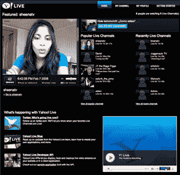

# 雅虎推出直播视频服务 TechCrunch

> 原文：<https://web.archive.org/web/https://techcrunch.com/2008/02/07/yahoo-launches-live-a-live-streaming-video-service/>

# 雅虎推出 Live——一项实时流媒体视频服务

考虑到本周围绕微软收购雅虎的混乱，一个新的雅虎产品发布会不会有丰富的丰富多彩也就不足为奇了。尽管如此，人们得到的关于雅虎直播(T4)已经上线的唯一消息是布拉德利·霍洛维茨博客上的一篇三个字的帖子:“(T5)直播就是直播(T6)”。

Yahoo Live 允许任何拥有网络摄像头的人将自己的视频直播到一个专用网站上。他们称之为“视频直播平台”

它与现有的流媒体直播服务非常相似，如 [Stickam](https://web.archive.org/web/20230124115244/http://www.stickam.com/) 、 [Justin.tv](https://web.archive.org/web/20230124115244/http://www.justin.tv/) 和 [Ustream](https://web.archive.org/web/20230124115244/http://www.ustream.tv/) 和 [Blogtv](https://web.archive.org/web/20230124115244/http://www.blogtv.com/) 。用户创建一个频道，授权他们的摄像头，并开始向公众广播。其他人可以顺便来看看，或者选择通过视频、声音或文本聊天来参与。

我们仍在测试，但目前服务非常不稳定，并且一直在下降。它显然也有自己的特色——例如，视频不是为了回放而存档的，这意味着一旦直播，就这样了。

用户可以为自己设置配置文件，并跟踪有多少人观看了他们的直播，他们进行了多少次广播，以及他们总共广播了多长时间。当您与其他人进行流式会话时，您的屏幕上最多可以同时显示五个其他人，其中一个是主要演示者，另外四个只是在会话中。其他所有人都可以在与该会话相关的聊天室中看到，这些会话也可以嵌入到网络中。

现在看起来雅虎已经雇佣了两个人——其中一个是女孩，她会应要求唱歌——通过提供一些持续的内容来帮助启动网站。雅虎还设立了一个推特账户，你可以关注它，看看谁在某个特定时间在看视频。想从 Yahoo Live 中提取信息并在其他地方访问吗？还有一个 [API](https://web.archive.org/web/20230124115244/http://developer.yahoo.com/ylive/) 可用。

**更新:**雅虎的查德·迪克森[在下面关于稳定性问题的评论中回应](https://web.archive.org/web/20230124115244/http://live.yahoo.com/)。