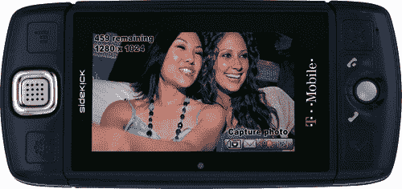

# 与此同时，微软以 5 亿美元收购 Danger TechCrunch

> 原文：<https://web.archive.org/web/https://techcrunch.com/2008/02/11/meanwhile-microsoft-buys-danger/>

当每个人都全神贯注于微软-雅虎的传奇故事时，微软的收购机器仍在隆隆前进。微软[今天宣布](https://web.archive.org/web/20230202002807/http://www.microsoft.com/presspass/press/2008/feb08/02-11RobinAcquisitionPR.mspx?rss_fdn=Press%20Releases)已经收购了广受欢迎的 Sidekick 手机制造商 [Danger](https://web.archive.org/web/20230202002807/http://www.danger.com/) 。我猜危险的首次公开募股根本不会发生。条款没有披露，但它正在试图通过首次公开募股筹集 1 亿美元。现在，移动平台公司将被纳入 Windows mobile 团队，成为包括 XBox 和 Zune 在内的整个娱乐和设备部门的一部分。

这是 Danger 去年 12 月提交给 SEC 的招股说明书。在 2007 财年(截至 9 月 30 日)，Danger 的收入为 5640 万美元(增长 14%)，净亏损为 1240 万美元(比上一年翻了一番)。自开始运营以来，它的累计净亏损为 1.88 亿美元。大约有 100 万用户(92.3 万)使用 Danger 移动设备——几乎全部来自 T-Mobile。投资者包括 Mobius Technology Ventures、Redpoint Ventures、T-Mobile Venture Fund、软银资本、摩托罗拉、Meritech Capital Partners 和 Venture Strategy Partners。该公司在过去八年中通过五轮融资筹集了约 1.42 亿美元。

所以微软只是买了一个 hip，但是赔钱的业务。这是微软对 iPhone 的回答吗？还是对谷歌安卓的一种回答？希望是后者。

Danger 手机运行的是 Windows Mobile 的操作系统，它们是最受消费者欢迎的支持互联网的手机之一，有一个完整的滑出式键盘。微软可以使用危险的~~手机~~心爱的操作系统和外形作为平台，创造一个完整的 Windows Mobile 体验，比 WinMo 提供更好的 IM 体验。这样，它就可以控制硬件和软件，就像苹果公司控制 iPhone 一样。但是手机业务是残酷的。看看摩托罗拉。微软最好是把 Danger 创造的所有软件创新都移植到 Windows Mobile 中，后者将很快面临来自运行谷歌开源 Android 移动操作系统的手机的竞争。如果这次收购是为了让 Windows Mobile 领先 Android 一步，那么这是一个明智之举。(当然，这里具有讽刺意味的是，Danger 的创始人之一安迪·鲁宾(Andy Rubin)现在在谷歌工作，是 Android 的幕后黑手)。如果微软打算利用 Danger 进入移动设备业务，那么其硬件部门继续亏损的可能性非常高。

**更新**:在收集了更多关于 Danger 的信息后，尽管它有亏损的历史，但很大一部分是由于 T-Mobile 合同的建立方式以及它如何从中确认收入。该公司正朝着现金流为正的方向发展。如果微软能让 T-Mobile 之外的运营商来提供助手，它可能会成为一个非常有价值的专营权。该交易的规模(根据猜测)可能在 5 亿美元左右。***2008 年 2 月 12 日更新** : GigaOm 拿出[一样的图](https://web.archive.org/web/20230202002807/http://gigaom.com/2008/02/12/how-much-did-microsoft-pay-for-danger-find-out-here/)。*

Microoft 的吸引力肯定是在软件方面，尽管看到 Zune 或 xBox portables 等移动硬件设备建立在 Danger 平台上也不要惊讶。Danger 很好地将移动设备上的计算任务保持在最低限度，并在服务器端完成了大部分繁重的工作。另一方面，WinMo 设备往往会将大量计算集中在设备本身上，这就是 Windows 智能手机昂贵而笨重的原因。有了 Danger，微软现在有了一个移动操作系统，可以给低端手机带来消息和互联网连接。也许这次收购只是意识到移动市场已经被高端和低端设备瓜分，这是微软在这两个领域都有所作为的一种方式。

但如果微软现在要提供两个移动操作系统，开发者将更难选择在哪个平台上开发应用。WinMo 的主要卖点是开发一次，你的应用可以在任何 WinMo 手机上运行。现在，开发者必须在两个微软移动操作系统之间做出选择，加上 Symbian、Blackberry、Android 和所有其他操作系统。

(通过[嘎吱齿轮](https://web.archive.org/web/20230202002807/http://www.crunchgear.com/2008/02/11/breaking-microsoft-swallows-up-danger-inc/)