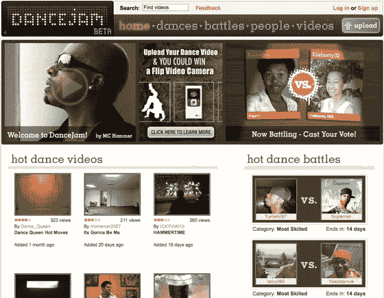

# 可以触及这个:DanceJam 向公众开放技术危机

> 原文：<https://web.archive.org/web/https://techcrunch.com/2008/03/01/can-touch-this-dancejam-opens-to-the-public/>

# 触及这个:舞蹈向公众开放

  舞蹈视频的 YouTube 网站 [DanceJam](https://web.archive.org/web/20230216054618/http://www.dancejam.com/) 经过几个月的私人测试后，今天已经进入开放测试阶段。

DanceJam 提供了舞蹈战，用户们相互对抗，观众投票选出最好的视频。DanceJam 还提供一般的舞蹈视频，包括本地上传的内容和来自外部网站如 YouTube 的视频。

DanceJam 是由 M.C. Hammer，以及来自 Flock 的 Geoffrey Arone 和 Anthony Young 创立的。该公司已在两轮融资中获得 450 万美元，投资者包括罗恩·康韦、亚历克斯·阿尔加德、迈克尔·坦纳、杰夫·罗尔斯顿、亚历克斯·韦尔奇、阿里尔·波莱尔、乡村峡谷合作伙伴、软银资本和迈克尔·阿灵顿。

您可以在这里看到一个“舞蹈果酱”的例子。

*披露:迈克尔(如帖子所述)是投资者，我不是。*

