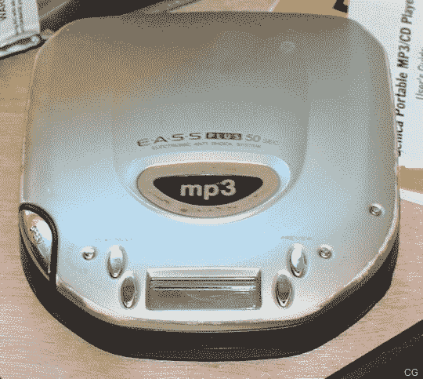

# MP3 播放器即将迎来十周年纪念日| TechCrunch

> 原文：<https://web.archive.org/web/https://techcrunch.com/2008/03/10/mp3-players-coming-up-on-ten-year-anniversary/>

# MP3 播放器即将迎来十周年纪念日

哦，哇，我想我老了。还有其他人拥有这个球员吗 Eiger Labs MPMan？

这是这里显示的 64 兆 F20，但我有 32 兆的 F10。还记得它是如何通过并口连接到你的电脑上，然后用*永远用*来传输歌曲的吗？

显然，这种设备的原型早在 1998 年 3 月就在 CeBIT 上展示过，同年 5 月开始销售。

我的 MPMan 早已不在了，但我一直保留着便携式 MP3 运动早期的一些遗物。点击跳转查看一些照片。

**Genica 便携式 MP3/CD 播放器**

这可能是第一台可以播放 MP3 光盘的便携式 CD 播放器。它是 2000 年由 Genica 制造的。如果我没记错的话，它是从 ComputerGeeks.com(现在的 Geeks.com)以 99 美元的价格预订了大约 6 个月。当时我是一名大三学生，我清楚地记得一个周五的早晨，UPS 快递员很早就按响了门铃。

第二天晚上，有人闯入我的车，偷走了它。我哭了——大颗大颗的抽泣——因为我知道要再找到一颗心将会是永远的事。此外，当时是凌晨四点，我整晚都在喝酒，所以我(不用说)有点情绪化。警察不明白这个设备有什么特别之处，因为他们不明白一张 CD 怎么能装 150 首歌。

当你喝醉的时候，试着向警察解释 MP3 压缩。

**Neo 玩家**

啊，新玩家。记得这个吗？那是一次自带硬盘的活动。只需安装一个 2.5 英寸的笔记本电脑驱动器，就万事大吉了。我也有汽车版，它使用的坞站可以滑入您的塔上的 3.5 英寸驱动器托架，然后滑入您放在汽车仪表板上的类似坞站。我希望我在某个地方还有它的照片。太棒了。

**袖珍移动站(Neo II)**

****

然后是 Neo 的继任者，Pocket m station——也被称为 Neo II，可能还有一堆其他名字。我从来没有真正爱上这一个，但可笑的大按钮使它很容易在车上使用。

这是所有这些老人的一张漂亮的全家福照片。我甚至有装膝骨的盒子。

有人有你早期 MP3 播放器的旧照片吗？把它们发给 Doug，我会把它们加到这个帖子里。

[十岁:世界上第一台 MP3 播放器](https://web.archive.org/web/20230311032110/http://www.reghardware.co.uk/2008/03/10/ft_first_mp3_player/)【注册硬件】