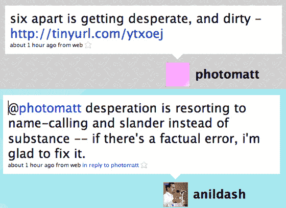

# Six Apart 瞄准 Wordpress 用户；Wordpress 生气了 TechCrunch

> 原文：<https://web.archive.org/web/https://techcrunch.com/2008/03/11/six-apart-takes-aim-at-wordpress-users-wordpress-pissed/>

# Six Apart 瞄准 WordPress 用户；WordPress 生气了

今天，Six Apart 的首席布道者阿尼尔·达什在[的博客文章](https://web.archive.org/web/20230208120420/http://www.movabletype.com/blog/2008/03/a-wordpress-25-upgrade-guide.html)中将矛头对准了 WordPress 用户。他说，与其升级到 WordPress 的新版本，不如考虑转移到他们的平台。

现在，针对你的竞争对手是一个公平的游戏，Dash 的博客文章是如此平淡，以至于我甚至找不到一个好的引用来写这篇文章。但是这并没有阻止 WordPress 创始人[马特·莫楞威格](https://web.archive.org/web/20230208120420/http://www.crunchbase.com/person/matt-mullenweg)的嗜血。在推特[消息](https://web.archive.org/web/20230208120420/http://twitter.com/photomatt/statuses/769658891)中，马特说*“六分之二变得绝望和肮脏。”*阿尼尔[几乎立即用*回击*](https://web.archive.org/web/20230208120420/http://twitter.com/anildash/statuses/769661018)“@ photomatt 绝望地诉诸于谩骂和诽谤，而不是实质——如果有事实错误，我很高兴能纠正它。”

上周，这两家公司在我们写的一篇文章的评论中针锋相对——见大卫·雷科顿(SixApart)和劳埃德·巴德(Automattic)的评论[从这里开始](https://web.archive.org/web/20230208120420/https://techcrunch.com/2008/03/04/wordpress-the-social-network/#comment-2016130)。

谁是对的？不知道。Dash 注意到升级 WordPress 并不容易。WordPress 的首席执行官 Toni Schneider 发邮件给我说一些博客作者实际上正在从可移动字体转向 WordPress。

显而易见的是，这两个平台都不是完美的，需要博客作者做太多的工作。他们都需要提防即将到来的[下一代平台](https://web.archive.org/web/20230208120420/https://techcrunch.com/2008/02/01/weblogs-inc-co-founder-brian-alvey-to-launch-crowd-fusion/)，这可能会吃掉他们的午餐。