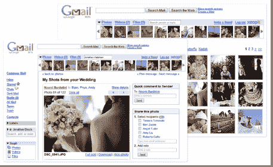

# Xoopit 让你的收件箱更加社会化。筹集 500 万美元并推出私人测试版(邀请)

> 原文：<https://web.archive.org/web/https://techcrunch.com/2008/03/31/xoopit-makes-your-inbox-more-social-raises-5-million-and-launches-private-beta-invites/>

# Xoopit 让你的收件箱更加社会化。筹集 500 万美元并推出私人测试版(邀请)

 我们越来越接近社交收件箱——与你的社交网络对话的电子邮件。今天， [Xoopit](https://web.archive.org/web/20221204184921/http://www.xoopit.com/) 发布私人测试版。不要与 Xobni(另一个电子邮件 2.0 应用)混淆，Xoopit 是 FireFox 的一个插件，可以让你轻松查看电子邮件中作为附件的所有照片、视频和文件，并通过网络链接发送给你。在这里注册的第一批 700 名 TechCrunch 读者将会进入。首席执行官 Bijan Marashi 解释道:

> 我们正在建立您在互联网上的个人信息的索引。电子邮件是你最重要的个人数据仓库。Xoopit 处理你堆积多年的社交媒体，将其转化为一个有趣的应用程序。

该应用程序会将您的 Gmail 编入索引(将来还会添加其他电子邮件服务)，并允许您查看附件(照片、视频等)。它还可以获取朋友从 Flickr、Picassa、Shutterfly、Kodak 或 YouTube 通过电子邮件发送给你的任何图像。它试图把你的电子邮件收件箱变成一个仪表盘，用来管理所有人一直发给你的图片和视频。反过来，你可以将自己的照片、视频和其他媒体直接发布到脸书、你的博客或电子邮件中。

Xoopit 还宣布从 Accel 和 Foundation Capital 获得 500 万美元的 A 轮投资。它之前从基金会资本、迈克尔·迪林、杰夫·罗尔斯顿和埃里克·泰莱纽斯那里筹集了 150 万美元的天使轮资金。

