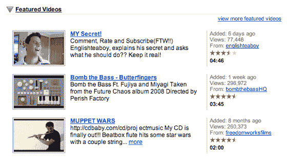

# YouTube RickRolls 用户| TechCrunch

> 原文：<https://web.archive.org/web/https://techcrunch.com/2008/03/31/youtube-rickrolls-users/>

如果你不熟悉[瑞克罗林](https://web.archive.org/web/20230320003258/http://en.wikipedia.org/wiki/Never_Gonna_Give_You_Up#.22Rickroll.22_Internet_meme)——它是指有人在网站上放了一个链接，但实际上它会带你去一个瑞克阿斯特利的热门歌曲《永不放弃》的音乐视频[。](https://web.archive.org/web/20230320003258/http://au.youtube.com/watch?v=Yu_moia-oVI)

YouTube 将于 4 月 1 日召回自己的用户。英国 YouTube[和澳大利亚 YouTube](https://web.archive.org/web/20230320003258/http://uk.youtube.com/)的所有特色视频实际上都链接到了里克·阿斯特利的视频。我们将会看到 YouTube.com 是否也会在美国东部时间今晚午夜做同样的事情。

这很好，但远没有 YouTube 团队闯入谷歌搜索服务器并简单地将 Google.com 重定向到该视频有趣。那会很有趣。

更多关于此[的报道请点击](https://web.archive.org/web/20230320003258/http://snurl.com/23478)。