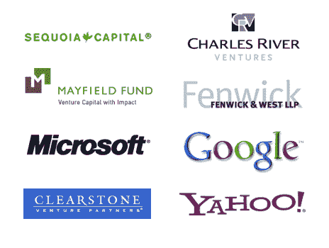

# 宣布 TechCrunch50 大会:9 月 8 日至 10 日，旧金山

> 原文：<https://web.archive.org/web/https://techcrunch.com/2008/04/02/announcing-the-techcrunch50-conference-september-8-10-san-francisco/>

  为 TechCrunch 和[杰森·卡拉卡尼斯](https://web.archive.org/web/20230206025533/http://www.calacanis.com/2008/04/02/techcrunch50-announced-september-8-10th-san-francisco/) : [TechCrunch50](https://web.archive.org/web/20230206025533/http://www.techcrunch50.com/2008/) 于 2008 年 9 月 8 日至 10 日在三藩市设计中心联合举办的第二届年度 TechCrunch 发布会做好准备。

就像去年的 [TechCrunch40](https://web.archive.org/web/20230206025533/http://www.techcrunch50.com/2007/) (除了将有十家以上的初创公司发布)，五十家新的初创公司和产品将在三天内发布。所有进入决赛的选手都将被择优挑选；他们无需付费即可参加或出席活动。由评委和组织者选出的在 TechCrunch50 上发布的最佳初创公司将获得 5 万美元的现金奖励(去年的[获奖者是 Mint](https://web.archive.org/web/20230206025533/https://techcrunch.com/2007/09/18/mint-wins-techcrunch40-50000-award/) )。

在去年的活动中推出的 40 家创业公司现在已经筹集了超过 1 . 43 亿美元的风险资本(并非所有都已公开披露)。这主要是因为他们都是优秀的初创公司。但是媒体和博客对这一事件的报道当然也不会造成伤害。

我们还将邀请专家小组成员在活动中发言，并对启动演示进行评判。去年的[专家在这里](https://web.archive.org/web/20230206025533/http://www.techcrunch50.com/2007/experts.php)。这些人中的许多人将会回来，还有一些新的法官。将在接下来的几个月内宣布与会专家。

**新场馆，新业态**

  TechCrunch50 是一个为期三天的会议，以容纳 10 个额外的初创公司发布，以及更多的小组和研讨会。今年我们要换地方。该活动将在旧金山设计中心举行，这是一个巨大而美丽的场地，可以轻松容纳 1000 多名与会者。

我们非常幸运地得到了一个庞大且不断壮大的企业合作伙伴团体的支持。[红杉资本](https://web.archive.org/web/20230206025533/http://www.sequoiacap.com/)、[梅菲尔德基金](https://web.archive.org/web/20230206025533/http://www.mayfield.com/)、[clear stone Venture Partners](https://web.archive.org/web/20230206025533/http://www.clearstone.com/)、 [Charles River Ventures](https://web.archive.org/web/20230206025533/http://www.crv.com/) 和 [Fenwick & West](https://web.archive.org/web/20230206025533/http://www.fenwick.com/) 都迅速回归，连续第二年支持我们。[谷歌](https://web.archive.org/web/20230206025533/http://www.google.com/)、[微软](https://web.archive.org/web/20230206025533/http://www.microsoftstartupzone.com/)和[雅虎](https://web.archive.org/web/20230206025533/http://www.yahoo.com/)也伸出了援手，我们非常感谢他们对我们基于绩效的会议形式的新承诺。
 

 **你的新产品适合 TechCrunch50 吗？**

如果你的初创公司或产品将在夏末或秋季推出，TechCrunch50 可能是你的完美发射台。重要的因素是，这家初创公司在活动之前没有任何公开曝光——这 50 个位置是为观众之前没有见过的新产品预留的。如果在活动的实际日期发布太快，我们将做出有限数量的例外，允许您在活动中展示产品演示。

**要知道的事情:**

官方网站: [TechCrunch50](https://web.archive.org/web/20230206025533/http://www.techcrunch50.com/2008/)
日期:2008 年 9 月 8 日至 10 日
参加门票: [TechCrunch50 门票](https://web.archive.org/web/20230206025533/http://www.techcrunch50.com/2008/get-tickets/)
申请启动/产品:[公司申请表](https://web.archive.org/web/20230206025533/http://www.techcrunch50.com/2008/submit-your-company/)
申请截止日期:2008 年 6 月 27 日星期五(提前考虑截止日期:6 月 13 日)

会议票务由 [EventBrite](https://web.archive.org/web/20230206025533/http://www.eventbrite.com/) 提供