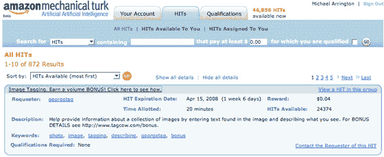
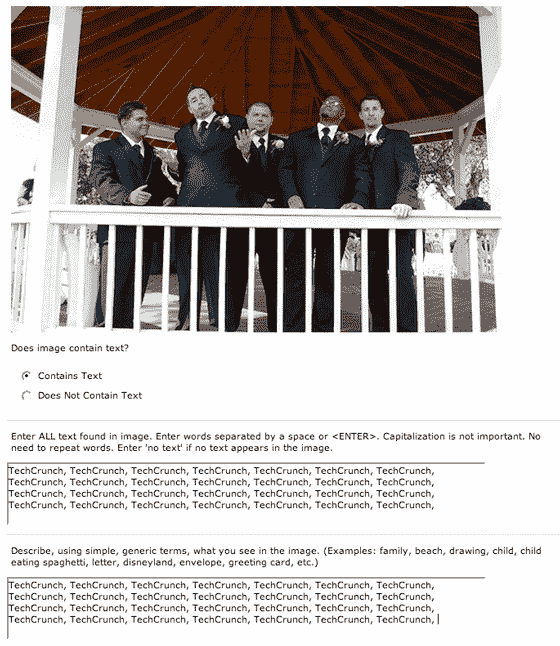

# 需要工作？标记照片每小时收费 1.20 美元 TechCrunch

> 原文：<https://web.archive.org/web/https://techcrunch.com/2008/04/02/need-a-job-make-120hour-tagging-photos/>

# 需要工作？制作 1.20 美元/小时的标签照片

  新服务[塔科](https://web.archive.org/web/20221209132743/http://www.tagcow.com/)在周末引起了[一点轰动](https://web.archive.org/web/20221209132743/http://www.beta.techcrunch.com/2008/03/29/image-recognition-problem-finally-solved-lets-pay-people-to-tag-photos/)。该产品似乎解决了照片的自动分类和标记问题，这似乎仍然超出了大多数初创公司的处理能力和软件技能。

用户上传照片——如果他们愿意，可以上传成千上万张——几分钟后，照片就会被返回，并附带极其准确的描述性关键词，便于以后的搜索和浏览。该产品运行得如此之好，而该网站对其背后的技术描述如此之少，以至于我推测人类正在后台进行这项工作。

还有…我是对的。一位读者提交了一份提示，称他们在亚马逊的 [Mechanical Turk](https://web.archive.org/web/20221209132743/http://www.mturk.com/) 服务上看到了这项服务，这是一项让人们做计算机很难做的事情的网络服务。TagCow 实际上非常适合机械土耳其人。

用户只需支付 4 美分，就可以正确标记一组五张照片。我在几张照片上贴了 20 次“TechCrunch”标签，收集了我的 4 美分，然后继续前进。我的猜测是，正确标记这五张照片大约需要两分钟。这意味着，如果你工作稳定，没有休息，你可以赚 1.20 美元/小时。如果你跑得更快，就要更多。

