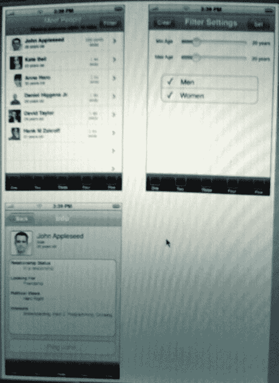

# 前几天我看到了社交网络的未来 TechCrunch

> 原文：<https://web.archive.org/web/https://techcrunch.com/2008/04/09/i-saw-the-future-of-social-networking-the-other-day/>

任何阅读这篇博客超过几个月的人都知道我看好移动社交网络。

在这一点上，空间是完全开放的——没有人创造出一个足够吸引人的应用程序来成为主流。这部分是因为技术限制——基于浏览器的网络不能利用移动设备的能力，基于客户端的应用程序被服务提供商和手机限制所阻止。

但是它来了。几年后，我们将使用移动设备来帮助我们记住我们认识但不熟的人的细节。这将有助于我们结识新的约会、商业和友谊的人。想象一下，走进一个会议、教室、聚会、酒吧、地铁站、飞机等等。和查看该地区其他人的个人资料信息。图片、姓名、约会状态、简历信息等。可用的信息将与设置相关——商务会议的快速 LinkedIn 类型信息与酒吧的脸书约会状态。

这需要一个拥有你的存在、位置和背景信息的社交网络。它需要知道你在哪里(通过 GPS 或三角测量)，你是在商业模式还是个人模式，以及你周围的人的类似信息。在基本层面上，它还需要根据你周围人的照片和名字，以及他们在寻找什么(约会、投资、工作、友谊)，对他们进行分类和浏览的能力。一旦这个网络建立起来，你就会知道你周围每个人的名字(如果他们选择分享的话)，如果你认识他们的话，还会有足够的基本信息来唤起你的记忆，或者如果你们有共同的兴趣，就去见他们。在脸书上戳别人是很棒的，但是当你和他们在同一个酒吧时“戳”他们会带来更直接的社会满足感。

获胜的移动社交网络将远远超越，比如说，[脸书的 iPhone 网站](https://web.archive.org/web/20230217025755/https://techcrunch.com/2007/08/15/facebook-iphone-ultrahype/)，它不利用位置信息，也不帮助你认识你周围的人。

因此，当移动社交网络初创公司向我们伸出援手时，我们会给予他们很多关注。2007 年 9 月，我费力地阅读了其中的一大堆[，接着在 12 月又看了一遍](https://web.archive.org/web/20230217025755/https://techcrunch.com/2007/09/11/the-holy-grail-for-mobile-social-networks/)[酸橙汁](https://web.archive.org/web/20230217025755/https://techcrunch.com/2007/12/06/limejuices-mobile-social-network-its-easy-and-so-people-may-use-it/)。

坦率地说，MySpace 和脸书可以通过专注于这个领域来锁定这个领域，但就我与两家公司高管的讨论来看，他们更专注于彼此，而不是主导移动领域。这给创业公司创造了一个难以置信的真空。

**用 iPhone 开始**

今年二月，我写了一篇名为“[的文章，会有一个(成功的)纯 iPhone 社交网络吗？](https://web.archive.org/web/20230217025755/https://techcrunch.com/2008/02/23/will-there-be-an-iphone-only-social-network/)”并提出了一个论点，即 iPhone SDK 为推出移动社交网络提供了一个令人信服的机会，同时避免了任何新网络(尤其是移动网络)都会遇到的先有鸡还是先有蛋的问题。iPhone 在硅谷和早期用户中的渗透率如此之高，以至于该应用程序可以在这些社区中病毒式传播。随着该网络获得牵引力，它可能会扩展到谷歌的 Android 平台，并从那里发展壮大。

iPhone 用户是推出该网络的最佳群体。他们充满激情，崇尚精英主义，喜欢加入一个只有 iPhone 的俱乐部。去参加一个聚会，看到那里每个拿着 iPhone 的人的照片和名字——然后和他们见面并加他们为好友。然后，一旦建立了相互的友谊，无论这些人在世界的哪个角落，你都可以看到他们，以及告诉你他们在想什么或在做什么的在线信息。

我非常相信这个想法，以至于我探索组建一个团队，在 iPhone SDK 的基础上构建一个基础网络。但上周，当我在 iPhone 上看到一个即将推出的社交网络的现场演示时，我放弃了这个想法，这个社交网络可以做我在 2 月份的帖子中呼吁的一切。

**它来了**

新应用背后的创业公司还不让我透露他们的名字。但是应用程序太棒了。它会显示你周围所有在 iPhone 上安装了它的人(默认隐私设置为关闭，但可以更改)。用户可以滚动浏览附近的用户，并为男性、女性或年龄范围设置过滤器。如果你发现有人感兴趣，你可以调出他们的个人资料，然后对他们进行 ping 操作。如果他们回复了，你可以通过电话或面对面的方式开始聊天。当然，他们也可以选择屏蔽你。

定位是基于 iPhone 的三角测量功能，这种功能足够精确，可以实现这一点。这家初创公司认为，他们已经找到了一种方法，可以绕过第三方 iPhone 应用程序[不能在后台运行的事实](https://web.archive.org/web/20230217025755/https://techcrunch.com/2008/03/07/iphone-sdk-some-of-the-details-arent-great/)(这意味着你必须打开应用程序，并且不使用任何其他 iPhone 功能，才能运行社交网络并看到其他人)。他们向我大致解释了这项工作，但要求暂时保密。

正如我所说的，我看到了在 iPhone 上运行的应用程序，甚至早期的原型也让我无语。我相信，它会很受欢迎，也很有价值。

这张图片展示了我在手机上看到的功能模型(我应该可以在接下来的一两周内展示它运行的照片或视频)。期待今年夏天 iPhone 应用商店开张时的发布会。

帖子顶部那张令人敬畏的图片归功于 [MediaSpin](https://web.archive.org/web/20230217025755/http://www.mediaspin.com/) 的汉克·格雷布。