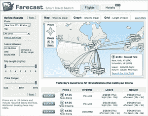

# 微软以 1 . 15 亿美元收购 Farecast

> 原文：<https://web.archive.org/web/https://techcrunch.com/2008/04/17/microsoft-acquires-farecast-for-115m/>

# 微软以 1 . 15 亿美元收购 Farecast

关于收购 [Farecast](https://web.archive.org/web/20230402093351/http://www.farecast.com/) 的传言是准确的——在一篇非常简短的博客[帖子](https://web.archive.org/web/20230402093351/http://www.farecast.com/blog/2008/04/microsoft-acquires-farecast/)首席执行官[休·克林](https://web.archive.org/web/20230402093351/http://www.crunchbase.com/person/hugh-crean)称他们已经被微软收购。

SeattlePI，上周第一个[打破](https://web.archive.org/web/20230402093351/http://blog.seattlepi.nwsource.com/venture/archives/136421.asp)谣言，[说](https://web.archive.org/web/20230402093351/http://blog.seattlepi.nwsource.com/venture/archives/136760.asp?source=mypi)标价是 1 . 15 亿美元。鉴于两家公司在 MSN Travel 上的接近和合作关系，这两家公司是可以理解的合适人选，但 SeattlePI 报道称，Farecast 在接受微软之前接受了多个报价。

Farecast 是一个机票价格比较工具，也使用预测算法来推荐您何时购买机票。因此，这个想法不仅仅是向用户展示谁的机票最便宜，还展示了等待是否有意义。该网站还保证收取额外费用的预测价格的门票。从去年秋天开始，它也开始帮助旅行者确定酒店价格的公平性。

这笔交易是在 Kayak 去年 12 月收购竞争对手 SideStep 之后达成的。