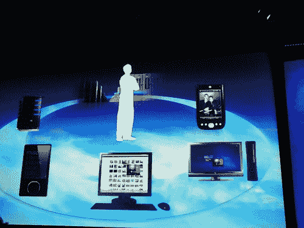
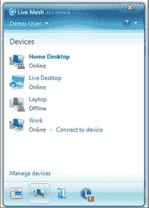
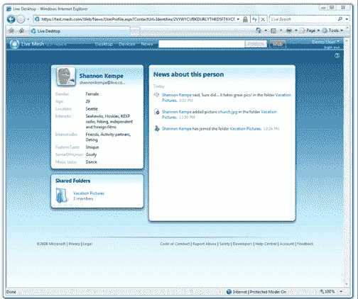

# 微软的 Mesh 揭示了——将所有应用和所有文件同步到所有设备(只要它们是 Windows)TechCrunch

> 原文：<https://web.archive.org/web/https://techcrunch.com/2008/04/22/microsofts-mesh-revealed%e2%80%94sync-all-apps-and-all-files-to-all-devices-as-long-as-theyre-windows/>

雷·奥茨第一次暗示 T2 是在去年三月的一次主题演讲中。但是今晚，微软终于发布了一个预览版的 [Live Mesh](https://web.archive.org/web/20221207074633/http://www.mesh.com/) ，一个新的 Windows Live 平台，用于同步文件，并最终跨不同设备同步应用程序。(当然，对于微软来说，一个测试版意味着 10，000 人，所以如果你现在注册，或者不注册，你都有很大的机会进入)。在首席软件架构师 Ozzie 努力使 Web 取代 PC 成为微软消费者体验的中心的过程中，Mesh 确实是一个关键因素。

 Mesh 让你在线设置一个虚拟桌面，并连接不同的电脑。将任何文件放入网格文件夹，它会自动在在线桌面和每台连接的计算机之间同步。选择一个文件或文件夹，您可以轻松地将其内容(照片、视频、音乐、文档)与任何朋友或家庭成员共享。您也可以从 Live Mesh 桌面远程控制已连接的电脑。目前，这适用于任何运行 Windows XP 或 Vista 的电脑。但更长远的愿景是真正让它在任何设备上都能工作。Mac 和移动版本将于今年晚些时候推出。最终，从 Xboxes 和 DVR 到数码相框和打印机的任何东西都可以通过网格连接起来。

在过去的两年里，Ozzie 的 100 名工程师一直在研究 Mesh。在发布时，它可能看起来不像是 Windows Live [SkyDrive](https://web.archive.org/web/20221207074633/http://www.crunchbase.com/product/windows-live-skydrive) 和 [FolderShare](https://web.archive.org/web/20221207074633/http://www.beta.techcrunch.com/tag/foldershare/) 的组合，但在本质上，它是一个雄心勃勃的平台游戏。Mesh 确实是针对开发者的。它不仅提供了一个在设备间同步文件的框架，还可以同步应用程序。它的方式是使用双向 RSS 或 Atom feed，由 Ozzie 开发，名为 [FeedSync](https://web.archive.org/web/20221207074633/http://dev.live.com/feedsync/) ，以前称为简单共享扩展。

Mesh 的基础就是这种以 feed 为中心的编程模型。Web 开发人员可以使用他喜欢的任何编程语言或工具(Python、Ruby on Rails、Flex)构建应用程序，然后使用双向馈送作为基本数据和通信通道，在设备和其他应用程序之间同步应用程序。产品部门经理 Abhay Parasnis 说，对开发人员的承诺是:“如果您的应用程序支持网格，我们将允许您将其扩展到其他设备。”

微软正在提供一套网格 API，包括存储服务、成员资格、同步、点对点通信和新闻订阅功能，该功能可以告诉用户不同文件夹的状态以及谁访问了它们。无论开发人员是为离线设备还是网络开发应用程序，都采用相同的编程模型

在许多方面，这种努力是对我们在 Adobe Air 或 Google Gears 上看到的努力的平衡，这些努力是为了让基于浏览器的应用程序离线。借助 Mesh，微软实际上是在重申基于客户端的应用程序的主导地位。它们不需要基于 Windows，但我相信这不会有什么坏处。开发人员可以为他们最初驻留的任何设备定制他们的应用程序——无论是 PC、智能手机还是机顶盒——然后通过将它们同步到网络上的其他应用程序来进行 Webify。在不放弃网络连接的情况下，这些应用程序可能比局限于类似浏览器的沙盒中的应用程序更强大。

给我的一个例子是一个基于 PC 的家谱应用程序，每当一个家庭成员在他们的计算机上做了改变，它就会更新。这个例子的问题，也可能是 Mesh 的问题，是同步问题已经有了解决方案。它叫 [Geni](https://web.archive.org/web/20221207074633/http://www.geni.com/) ，是一个 Web app。不过，我想看到的是 Word 或 Excel 的网状版本。这至少可以开始应对谷歌文档和其他在线生产力应用带来的威胁。Mesh 将客户端应用*和你认识的人联系在一起，从而使它们成为社交应用*。

直觉上，Ozzie 理解微软需要这种重心转移。在一份发给员工的[战略备忘录](https://web.archive.org/web/20221207074633/http://www.beta.techcrunch.com/2008/04/22/the-ozzie-memo%e2%80%94software-is-dead-long-live-the-web/)中，他写道:

> *对个人而言,“我的电脑”的概念将让位于个人设备网络的概念——通过这种方式，你所有的设备将被集合在一起，通过网络作为一个无缝的整体进行管理。*
> 
> 。。。Live Mesh 是一种新的服务平台技术，也将成为 Windows Live 的一部分，它通过将您的设备聚集在一起，以网络为中心协同工作，进一步扩展了 Windows/Windows Mobile/Windows Live 体验，从而支持:
> 
> **统一设备管理**–用户将通过简单的网络服务注册他们的设备。一旦成为用户设备网络的一部分，只要他们碰巧连接到互联网，设备就会向服务“报告”,例如状态、健康、位置以及交换/同步信息。网格感知设备配置/个性化将通过网络完成，并且可从任何地方对设备(例如远程桌面)进行完全远程控制。
> 
> **统一应用程序管理**–在任何或所有设备上安装和管理“网格感知”应用程序，以及
> 它们的应用程序设置和数据，对用户来说将是简单而透明的。个人现在将享受以前仅在企业环境中提供的集中式
> 跨设备购买/部署体验。
> 
> **统一数据管理**–文件夹和文件(例如文档和媒体)将自动同步，并可在任何或所有设备上以及通过网络使用。因为每个文件夹现在都可以扩展到网络上，所以即使是基于 PC 的文档和媒体现在也可以包含社交网络元素。

如果 Mesh 被采用，它将保护微软基于客户端和服务器的软件特许经营权，同时为“整合”其他公司的应用程序开辟新的收入来源。最终看到微软对支持网格服务(如存储、同步和用户之间的消息传递)的云计算服务实行公用事业定价，不要感到惊讶。但这一时半会儿还不会到来。首先，它需要被收养。

这是一份评论指南，下面是截屏。

document . write(")；

[http://documents.scribd.com/ScribdViewer.swf?document _ id = 2603063&access _ key = key-1 rpcbn 9 ibpcj 475 nuiex&page =&version = 1](https://web.archive.org/web/20221207074633/http://documents.scribd.com/ScribdViewer.swf?document_id=2603063&access_key=key-1rpcbn9ibpcj475nuiex&page=&version=1)

var scribd_doc = new scribd。文档(2603063，' key-1 rpcbn 9 IBP CJ 475 nuiex ')；scribd _ doc . write(' embedded _ flash _ 2603063 _ ptue ')；

[T3](https://web.archive.org/web/20221207074633/https://beta.techcrunch.com/wp-content/uploads/2008/04/livemesh-1.png "livemesh-1.png")T5T7[T9](https://web.archive.org/web/20221207074633/https://beta.techcrunch.com/wp-content/uploads/2008/04/livemesh-3.png "livemesh-3.png")