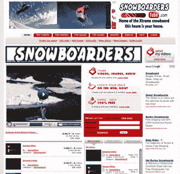

# 创建你自己的 YouTube，祈祷你能赚钱

> 原文：<https://web.archive.org/web/https://techcrunch.com/2008/04/24/create-your-own-youtube-pray-you-can-make-money/>

# 创建你自己的 YouTube，祈祷你能赚钱

“YouTube 卖了 16 亿美元。你的要卖多少钱？”

这是 [StartYourTube](https://web.archive.org/web/20221209112622/http://www.startyourtube.com/) 用来吸引人们在其白标平台上建立品牌视频分享网站的过于乐观的诱饵。

StartYourTube 顾名思义就是这样做的。你可以进入网站，创建自己的“管道”，用颜色和图形定制它，将其屏蔽到你自己的域，邀请朋友，并开始加载内容。这些管道不仅可以播放视频，还可以播放图片、音频文件和博客。

它们的外观和感觉也很像 YouTube，有最近、最多浏览和最多浏览的列表。用户可以对视频进行投票和评论；然而，每个视频都没有相关的视频列表。

这是一项完全免费的服务，令人困惑的是，用户看不到任何收入来源。 ( **更新:**正如评论者[所注意到的](https://web.archive.org/web/20221209112622/http://www.beta.techcrunch.com/2008/04/24/create-your-own-youtube-pray-you-can-make-money/#comment-2221855)，提高你的 tube 上可以添加多少内容以及你可以接收多少观看次数的限制实际上是要付出代价的)。出版商可以获得 100 %60%的广告收入，该网站甚至为“顶级管道”开展了 500 美元的促销赠品活动。

到目前为止，已经制作了超过 11，000 个管子，包括用于滑雪板和动漫的管子。一个直截了当的白色标签视频分享平台的出现也许是不可避免的，尤其是考虑到像宁这样的消费者社交媒体平台的成功。

但它不是第一家赋予用户和企业更多权力来管理在线视频的公司。Magnify 的理念是围绕其他地方托管的视频创建专门的频道。 [Reality Digital](https://web.archive.org/web/20221209112622/http://www.realitydigital.com/) 、 [KickApps](https://web.archive.org/web/20221209112622/http://www.kickapps.com/) 和 [VSocial](https://web.archive.org/web/20221209112622/http://www.vsocial.com/) 都提供与现有网站整合的视频托管服务。现在有了 YouTube 的 API，在线视频大猩猩本身给了开发者更多在网络上管理视频的控制权。